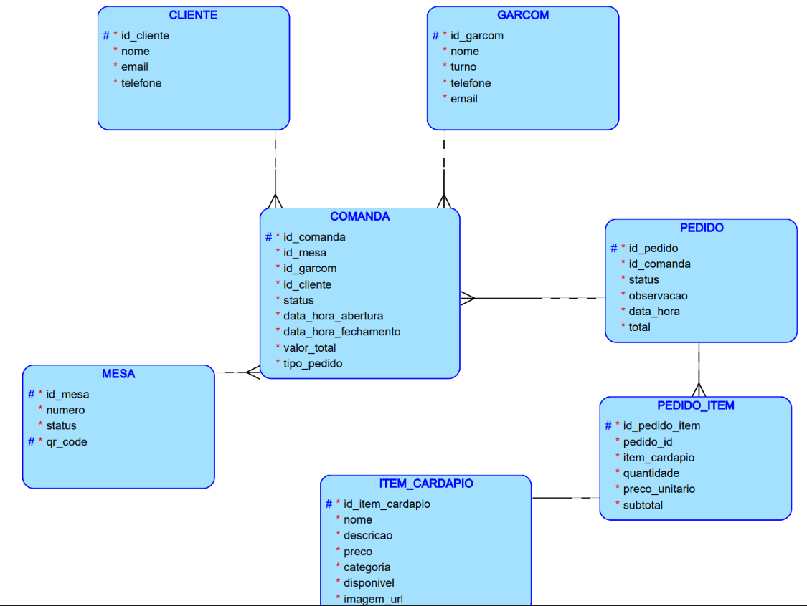

# 📱 Pedix API - Comanda Digital Inteligente

## 📝 Descrição do Projeto
O **Pedix** é uma aplicação backend desenvolvida em **Java com Spring Boot** que gerencia pedidos e itens de cardápio em restaurantes, lanchonetes ou serviços de alimentação.  
A aplicação permite criar, consultar, atualizar e deletar pedidos e itens do cardápio, garantindo persistência em **banco de dados Oracle** e fornecendo uma API **RESTful** com documentação Swagger/OpenAPI.

O objetivo é proporcionar uma **gestão digital eficiente de comandas**, atendendo às solicitações do cliente de forma rápida, segura e confiável.


## 📅 Cronograma de Desenvolvimento

| Atividade                         | Responsável | Prazo      | Status      |
|-----------------------------------|-------------|------------|------------|
| Configuração do Spring Boot       | Alane       | 05/10/2025 | Concluído  |
| Criação das classes de domínio    | Alane       | 05/10/2025 | Concluído  |
| Implementação dos endpoints       | Alane       | 06/10/2025 | Concluído  |
| Testes API (Postman)              | Anna/Maria  | 09/10/2025 | Concluído  |
| Documentação e README             | Alane       | 06/10/2025 | Concluído  |


## 🧩 Visão Geral e Arquitetura

A **Pedix API** segue os princípios da **Clean Architecture** e do **Domain-Driven Design (DDD)**, garantindo baixo acoplamento e alta coesão entre as camadas da aplicação.

```mermaid
flowchart TD
    %% Camada de apresentação
    subgraph API_Camada_de_Apresentacao
        A[Controllers - RestController]
    end

    %% Camada de regras de negócio
    subgraph Application_Regras_de_Negocio
        B[Services - Service]
        G[DTOs e Validations]
    end

    %% Camada de domínio
    subgraph Domain_Modelo_de_Dominio
        C[Entidades JPA: ItemCardapio, Pedido, PedidoItem]
        H[Enums: StatusPedido, CategoriaItem]
    end

    %% Camada de infraestrutura e integrações
    subgraph Infrastructure_Persistencia_e_Integracoes
        D[Repositories - Spring Data JPA]
        E[(Banco de Dados Oracle)]
        F[API C# - Comandas e Clientes]
    end

    %% Fluxos de dependência
    A --> B
    B --> C
    B --> D
    D --> E
    C --> H
    B --> G
    B --> F
    
```



🏗️ Camadas e Responsabilidades

A arquitetura da Pedix API segue o padrão de camadas bem definidas, promovendo baixo acoplamento e alta coesão entre os componentes da aplicação.

| Camada                                   | Pacote                     | Responsabilidade                                                                                                                                                                    |
| ---------------------------------------- | -------------------------- | ----------------------------------------------------------------------------------------------------------------------------------------------------------------------------------- |
| **Apresentação (Controller)**            | `com.pedix.api.controller` | Define os **endpoints REST** da API — exemplos: `/api/item-cardapio`, `/api/pedido`. É responsável por receber as requisições HTTP e delegar o processamento às classes de serviço. |
| **Aplicação (Service)**                  | `com.pedix.api.service`    | Implementa as **regras de negócio**, orquestra entidades e repositórios, e aplica validações funcionais antes de persistir ou retornar dados.                                       |
| **Domínio (Entities / Enums)**           | `com.pedix.api.domain`     | Contém as **entidades JPA** e **enums** que representam o modelo de negócio, como `ItemCardapio`, `Pedido`, `PedidoItem`, `StatusPedido` e `CategoriaItem`.                         |
| **Infraestrutura (Repository / Oracle)** | `com.pedix.api.repository` | Gerencia a **persistência dos dados** com **Spring Data JPA**, realizando a comunicação com o **banco Oracle** configurado na aplicação.                                            |
| **Integrações Externas (C#)**            | `REST API em .NET`         | Comunicação planejada com o **microserviço de atendimento** desenvolvido em C#, responsável por comandas, mesas e clientes.                                                         |


## ⚙️ Tecnologias Utilizadas

| Categoria       | Tecnologia           | Uso Principal                                                 |
|-----------------|--------------------|---------------------------------------------------------------|
| Linguagem       | 📦 Java 22          | Linguagem de desenvolvimento backend.                         |
| Framework       | 🌱 Spring Boot 3    | Facilita a criação de aplicações RESTful standalone.          |
| Persistência    | 🗄️ JPA / Hibernate | Mapeamento Objeto-Relacional (ORM).                           |
| Banco de Dados  | 💾 Oracle 12c       | Armazenamento persistente dos dados.                          |
| Utilitário      | ✨ Lombok           | Redução de código boilerplate (getters, setters, construtores). |
| Documentação    | 📖 Swagger / OpenAPI| Geração automática da documentação da API.                    |
| Build           | 🛠️ Maven           | Gerenciamento de dependências e ciclo de vida do projeto.     |
| Teste           | 📬 Postman / Insomnia| Teste manual dos endpoints da API.                            |

---

## 📂 Estrutura do Projeto
```
pedix.api/
├── .idea           → Configurações do ambiente de desenvolvimento (IntelliJ IDEA).
├── .mvn            → Wrappers do Maven.
├── pedix-api       → (Pasta gerada/nome do módulo)
├── src
│   ├── main
│   │   ├── java/com/pedix/api
│   │   │   ├── config      → Configurações gerais da aplicação (segurança, beans).
│   │   │   ├── controller  → Endpoints REST (API). Lida com requisições HTTP e delega para o Service.
│   │   │   ├── domain      → Entidades JPA (Modelos de domínio como Pedido, ItemCardapio, etc.).
│   │   │   ├── dto         → Data Transfer Objects (DTOs), usados com validação funcional.
│   │   │   ├── repository  → Repositórios JPA (Interfaces) para acesso ao banco de dados.
│   │   │   ├── service     → Serviços da aplicação (Business Logic) e lógica transacional.
│   │   │   ├── DatabaseInitializer → Componente para inicialização de dados (se necessário).
│   │   │   └── PedixApplication    → Classe principal que inicializa o Spring Boot.
│   │   │
│   │   └── resources
│   │       └── application.properties → Configuração do banco de dados, ambiente e Swagger.
│   │
│   └── test
│       └── java/com/pedix/api → Contém os testes unitários e de integração.
│
├── target          → Diretório gerado pelo Maven, contém os artefatos de build.
├── .gitignore      → Arquivo de ignorar arquivos para o Git.
├── pom.xml         → Arquivo de configuração do Maven.
├── README.md       → Informações e instruções iniciais do projeto.
└── HELP.md         → Arquivo de ajuda (geralmente gerado pelo Spring Initializr).
```


## 🛠 Funcionalidades
A aplicação **Pedix API** permite gerenciar **pedidos** e **itens do cardápio**, oferecendo os principais endpoints para **CRUD** (Create, Read, Update, Delete) e atualização de status de pedidos.

###  🚀  Endpoints da API Pedix

## 📦 Cardápio
| Método   | Endpoint                             | Descrição                                                    | Exemplo de uso                                                                                                     |
| :------- | :----------------------------------- | :----------------------------------------------------------- | :----------------------------------------------------------------------------------------------------------------- |
| `GET`    | `/api/item-cardapio`                 | Lista todos os itens disponíveis no cardápio.                | [http://localhost:8080/api/item-cardapio](http://localhost:8080/api/item-cardapio)                                 |
| `GET`    | `/api/item-cardapio?categoria=PRATO` | Filtra itens por categoria (`PRATO`, `BEBIDA`, `SOBREMESA`). | [http://localhost:8080/api/item-cardapio?categoria=PRATO](http://localhost:8080/api/item-cardapio?categoria=PRATO) |
| `GET`    | `/api/item-cardapio/{id}`            | Busca um item específico pelo ID.                            | [http://localhost:8080/api/item-cardapio/1](http://localhost:8080/api/item-cardapio/1)                             |
| `POST`   | `/api/item-cardapio`                 | Cria um novo item do cardápio.                               | —                                                                                                                  |
| `PUT`    | `/api/item-cardapio/{id}`            | Atualiza os dados de um item existente.                      | —                                                                                                                  |
| `DELETE` | `/api/item-cardapio/{id}`            | Exclui um item do cardápio.                                  | —                                                                                                                  |


## 🛒 Pedido

| Método | Endpoint                                | Descrição                                        | Exemplo de uso                                                                                 |
| :----- | :-------------------------------------- | :----------------------------------------------- | :--------------------------------------------------------------------------------------------- |
| `GET`  | `/api/pedido/{id}`                      | Busca um pedido específico pelo ID.              | [http://localhost:8080/api/pedido/1](http://localhost:8080/api/pedido/1)                       |
| `GET`  | `/api/pedido/comanda/{comandaId}`       | Lista todos os pedidos vinculados a uma comanda. | [http://localhost:8080/api/pedido/comanda/1001](http://localhost:8080/api/pedido/comanda/1001) |
| `POST` | `/api/pedido/comanda/{comandaId}`       | Cria um novo pedido vinculado a uma comanda.     | —                                                                                              |
| `PUT`  | `/api/pedido/{id}/status?status=PRONTO` | Atualiza o status de um pedido existente.        | —                                                                                              |


## 💻 Exemplos de Request/Response para testar

### 🍽️ Endpoints de Item do Cardápio

📝 GET /api/item-cardapio - Lista todos os itens disponíveis.
🔗 URL de teste: GET http://localhost:8080/api/item-cardapio


✅ Resposta esperada:
```
[
  {
    "id": 1,
    "nome": "Pizza Calabresa",
    "descricao": "Deliciosa pizza com calabresa",
    "categoria": "PRATO",
    "preco": 35,
    "disponivel": true
  },
  {
    "id": 2,
    "nome": "Refrigerante",
    "descricao": "Coca Cola 350ml",
    "categoria": "BEBIDA",
    "preco": 8.5,
    "disponivel": true
  },
  {
    "id": 3,
    "nome": "Sorvete Chocolate",
    "descricao": "Sobremesa gelada",
    "categoria": "SOBREMESA",
    "preco": 12,
    "disponivel": true
  },
  {
    "id": 4,
    "nome": "Pizza Mussarela",
    "descricao": "Pizza de mussarela com borda recheada",
    "categoria": "PRATO",
    "preco": 38,
    "disponivel": true
  },
  {
    "id": 5,
    "nome": "Pizza Frango",
    "descricao": "Pizza de frango com catupiry",
    "categoria": "PRATO",
    "preco": 40,
    "disponivel": true
  },
  {
    "id": 6,
    "nome": "Suco Laranja",
    "descricao": "Suco natural 300ml",
    "categoria": "BEBIDA",
    "preco": 7.5,
    "disponivel": true
  },
  {
    "id": 7,
    "nome": "Salada Caesar",
    "descricao": "Salada com alface, frango e molho caesar",
    "categoria": "PRATO",
    "preco": 25,
    "disponivel": true
  },
  {
    "id": 8,
    "nome": "Brownie",
    "descricao": "Brownie de chocolate com nozes",
    "categoria": "SOBREMESA",
    "preco": 10,
    "disponivel": true
  },
  {
    "id": 9,
    "nome": "Água Mineral",
    "descricao": "Água sem gás 500ml",
    "categoria": "BEBIDA",
    "preco": 5,
    "disponivel": true
  },
  {
    "id": 10,
    "nome": "Pizza Portuguesa",
    "descricao": "Pizza com presunto, ovos e azeitonas",
    "categoria": "PRATO",
    "preco": 42,
    "disponivel": true
  }
]
```

➕ POST /api/item-cardapio — Cria um novo item do cardápio
🔗 URL de teste: http://localhost:8080/api/item-cardapio

📤 Exemplo de Requisição:

```

{
  "nome": "Hambúrguer Artesanal",
  "descricao": "Hambúrguer com queijo e bacon artesanal",
  "preco": 28.90,
  "categoria": "PRATO",
  "disponivel": true,
  "imagemUrl": null
}

```

✅ Resposta esperada:

```
{
  "mensagem": "🍔 Item do cardápio criado com sucesso!",
  "item": {
    "id": 11,
    "nome": "Hambúrguer Artesanal",
    "descricao": "Hambúrguer com queijo e bacon artesanal",
    "preco": 28.90,
    "categoria": "PRATO",
    "disponivel": true,
    "imagemUrl": null
  }
}


```

✏️ PUT /api/item-cardapio/{id} — Atualiza um item existente (ex: id = 1)

🔗 URL de teste: http://localhost:8080/api/item-cardapio/1

📤 Exemplo de Requisição:

```
{
  "nome": "Pizza Calabresa Grande",
  "descricao": "Pizza com calabresa e queijo extra",
  "preco": 40.00,
  "categoria": "PRATO",
  "disponivel": true,
  "imagemUrl": null
}


```
✅ Resposta esperada:

```
{
  "mensagem": "✅ Item do cardápio atualizado com sucesso!",
  "item": {
    "id": 1,
    "nome": "Pizza Calabresa Grande",
    "descricao": "Pizza com calabresa e queijo extra",
    "preco": 40.00,
    "categoria": "PRATO",
    "disponivel": true,
    "imagemUrl": null
  }
}


```

🗑️ DELETE /api/item-cardapio/{id} — Deleta um item do cardápio (ex: id = 2)

🔗 URL de teste: http://localhost:8080/api/item-cardapio/2

✅ Resposta esperada:
```
{
  "mensagem": "🗑️ Item do cardápio removido com sucesso!"
}

```

### 🧾 Endpoints de Pedido

📄 GET /api/pedido/comanda/{comandaId} — Lista pedidos de uma comanda (ex: comandaId = 1001)

🔗 URL de teste: http://localhost:8080/api/pedido/comanda/1001


✅ Resposta esperada:

```
[
  {
    "id": 1,
    "comandaId": 1001,
    "status": "EM_PREPARO",
    "observacao": "Sem queijo ralado",
    "total": 35,
    "dataHora": "2025-10-11T01:02:26.678078",
    "itens": [
      {
        "id": 1,
        "itemCardapio": {
          "id": 1,
          "nome": "Pizza Calabresa",
          "descricao": "Deliciosa pizza com calabresa",
          "categoria": "PRATO",
          "preco": 35,
          "disponivel": true
        },
        "quantidade": 1,
        "precoUnitario": 35,
        "subtotal": 35
      }
    ]
  }
]
```

➕ POST /api/pedido — Cria um novo pedido

🔗 URL de teste: http://localhost:8080/api/pedido/comanda/1002

📤 Exemplo de Requisição:
```
{
  "itens": [
    {
      "itemCardapioId": 2,
      "quantidade": 2
    },
    {
      "itemCardapioId": 3,
      "quantidade": 1
    }
  ],
  "observacao": "Um refrigerante com gelo"
}

```

✅ Resposta esperada:
```
{
  "mensagem": "🧾 Pedido criado com sucesso!",
  "pedido": {
    "id": 5,
    "idComanda": 1002,
    "status": "EM_PREPARO",
    "total": 29.00,
    "observacao": "Um refrigerante com gelo",
    "itens": [
      {
        "itemCardapioId": 2,
        "quantidade": 2,
        "precoUnitario": 8.50,
        "subtotal": 17.00
      },
      {
        "itemCardapioId": 3,
        "quantidade": 1,
        "precoUnitario": 12.00,
        "subtotal": 12.00
      }
    ]
  }
}
```

🔄 PUT /api/pedido/{id}/status?status=PRONTO — Atualiza o status de um pedido (ex: id = 1)

🔗 URL de teste: http://localhost:8080/api/pedido/1/status?status=PRONTO

✅ Resposta esperada:

```
{
  "mensagem": "✅ Status do pedido atualizado com sucesso!",
  "pedido": {
    "id": 1,
    "idComanda": 1001,
    "status": "PRONTO",
    "total": 35.00,
    "dataHora": "2025-10-05T21:00:00"
  }
}

```


💡 Status possíveis de Pedido

| Código             | Descrição                     |
| :----------------- | :---------------------------- |
| 🧑‍🍳 `EM_PREPARO` | Pedido em preparo na cozinha  |
| ✅ `PRONTO`         | Pedido finalizado e pronto    |
| 🚚 `ENTREGUE`      | Pedido entregue ao cliente    |
| ❌ `CANCELADO`      | Pedido cancelado pelo cliente |


## 🛡 Validação Funcional
Todos os DTOs utilizam **anotações de validação** do Jakarta Bean Validation:
- `@NotNull` – campos obrigatórios
- `@NotBlank` – strings não podem ser vazias
- `@Positive` – valores numéricos devem ser positivos
- `@Size` – limites de tamanho de strings

---


## 🗃️ Script SQL (Oracle)
Criação de Tabelas, Sequences, Triggers e Dados Iniciais — Sistema Pedix

### 🧹 Reset do Banco (Seguro)
```
BEGIN
FOR t IN (SELECT table_name FROM user_tables) LOOP
EXECUTE IMMEDIATE 'DROP TABLE "' || t.table_name || '" CASCADE CONSTRAINTS';
END LOOP;
END;
/
```

## 🔢 Sequences

```
BEGIN
EXECUTE IMMEDIATE 'DROP SEQUENCE item_cardapio_seq';
EXCEPTION WHEN OTHERS THEN NULL;
END;
/

BEGIN
EXECUTE IMMEDIATE 'DROP SEQUENCE pedido_seq';
EXCEPTION WHEN OTHERS THEN NULL;
END;
/

BEGIN
EXECUTE IMMEDIATE 'DROP SEQUENCE pedido_item_seq';
EXCEPTION WHEN OTHERS THEN NULL;
END;
/

CREATE SEQUENCE item_cardapio_seq START WITH 1 INCREMENT BY 1 NOCACHE NOCYCLE;
CREATE SEQUENCE pedido_seq START WITH 1 INCREMENT BY 1 NOCACHE NOCYCLE;
CREATE SEQUENCE pedido_item_seq START WITH 1 INCREMENT BY 1 NOCACHE NOCYCLE;
```

```
CREATE TABLE item_cardapio (
id NUMBER GENERATED BY DEFAULT AS IDENTITY PRIMARY KEY,
nome VARCHAR2(255) NOT NULL,
descricao VARCHAR2(500),
preco NUMBER(10,2) NOT NULL,
categoria VARCHAR2(50),
disponivel NUMBER(1) DEFAULT 1,
imagem_url VARCHAR2(500)
);
```


## 🧩 Criação das Tabelas

### 1️⃣ Tabela ITEM_CARDAPIO

Representa os itens disponíveis no cardápio (pratos, bebidas e sobremesas).

```
CREATE TABLE item_cardapio (
id              NUMBER PRIMARY KEY,
nome            VARCHAR2(255) NOT NULL,
descricao       VARCHAR2(500),
preco           NUMBER(10,2) NOT NULL,
categoria       VARCHAR2(50),
disponivel      NUMBER(1) DEFAULT 1,
imagem_url      VARCHAR2(500)
);
```

### 2️⃣ Tabela PEDIDO

Armazena os pedidos vinculados a uma comanda.

```
CREATE TABLE pedido (
id              NUMBER PRIMARY KEY,
id_comanda      NUMBER NOT NULL,
status          VARCHAR2(50) DEFAULT 'EM_PREPARO',
observacao      VARCHAR2(500),
data_hora       TIMESTAMP DEFAULT SYSTIMESTAMP,
total           NUMBER(12,2) DEFAULT 0
);
```

### 3️⃣ Tabela PEDIDO_ITEM

Relação N:N entre pedidos e itens do cardápio.
```
CREATE TABLE pedido_item (
  id                NUMBER PRIMARY KEY,
  pedido_id         NUMBER NOT NULL,
  item_cardapio_id  NUMBER NOT NULL,
  quantidade        NUMBER(5) NOT NULL,
  preco_unitario    NUMBER(10,2) NOT NULL,
  subtotal          NUMBER(12,2) NOT NULL,
  CONSTRAINT fk_pedido FOREIGN KEY (pedido_id) REFERENCES pedido(id) ON DELETE CASCADE,
  CONSTRAINT fk_item FOREIGN KEY (item_cardapio_id) REFERENCES item_cardapio(id)
);
```

## ⚙️ Triggers (Auto Incremento via Sequence)
```
CREATE OR REPLACE TRIGGER trg_item_cardapio_id
BEFORE INSERT ON item_cardapio
FOR EACH ROW
WHEN (NEW.id IS NULL)
BEGIN
SELECT item_cardapio_seq.NEXTVAL INTO :NEW.id FROM dual;
END;
/

----------------------------------------------------------
CREATE OR REPLACE TRIGGER trg_pedido_id
BEFORE INSERT ON pedido
FOR EACH ROW
WHEN (NEW.id IS NULL)
BEGIN
  SELECT pedido_seq.NEXTVAL INTO :NEW.id FROM dual;
END;
/
------------------------------------------------------------
CREATE OR REPLACE TRIGGER trg_pedido_item_id
BEFORE INSERT ON pedido_item
FOR EACH ROW
WHEN (NEW.id IS NULL)
BEGIN
  SELECT pedido_item_seq.NEXTVAL INTO :NEW.id FROM dual;
END;
/
```
## 🍕 Inserts Iniciais — ITEM_CARDAPIO
```
INSERT INTO item_cardapio (nome, descricao, preco, categoria, disponivel, imagem_url)
VALUES ('Pizza Calabresa', 'Deliciosa pizza com calabresa', 35.00, 'PRATO', 1, NULL);

INSERT INTO item_cardapio (nome, descricao, preco, categoria, disponivel, imagem_url)
VALUES ('Refrigerante', 'Coca Cola 350ml', 8.50, 'BEBIDA', 1, NULL);

INSERT INTO item_cardapio (nome, descricao, preco, categoria, disponivel, imagem_url)
VALUES ('Sorvete Chocolate', 'Sobremesa gelada', 12.00, 'SOBREMESA', 1, NULL);

INSERT INTO item_cardapio (nome, descricao, preco, categoria, disponivel, imagem_url)
VALUES ('Pizza Mussarela', 'Pizza de mussarela com borda recheada', 38.00, 'PRATO', 1, NULL);

INSERT INTO item_cardapio (nome, descricao, preco, categoria, disponivel, imagem_url)
VALUES ('Pizza Frango', 'Pizza de frango com catupiry', 40.00, 'PRATO', 1, NULL);

INSERT INTO item_cardapio (nome, descricao, preco, categoria, disponivel, imagem_url)
VALUES ('Suco Laranja', 'Suco natural 300ml', 7.50, 'BEBIDA', 1, NULL);

INSERT INTO item_cardapio (nome, descricao, preco, categoria, disponivel, imagem_url)
VALUES ('Salada Caesar', 'Salada com alface, frango e molho caesar', 25.00, 'PRATO', 1, NULL);

INSERT INTO item_cardapio (nome, descricao, preco, categoria, disponivel, imagem_url)
VALUES ('Brownie', 'Brownie de chocolate com nozes', 10.00, 'SOBREMESA', 1, NULL);

INSERT INTO item_cardapio (nome, descricao, preco, categoria, disponivel, imagem_url)
VALUES ('Água Mineral', 'Água sem gás 500ml', 5.00, 'BEBIDA', 1, NULL);

INSERT INTO item_cardapio (nome, descricao, preco, categoria, disponivel, imagem_url)
VALUES ('Pizza Portuguesa', 'Pizza com presunto, ovos e azeitonas', 42.00, 'PRATO', 1, NULL);
```

## 🧾 Inserts Iniciais — PEDIDO e PEDIDO_ITEM

### 🕐 Pedido 1 — EM_PREPARO

```
INSERT INTO pedido (id_comanda, status, observacao, total)
VALUES (1001, 'EM_PREPARO', 'Sem queijo ralado', 35.00);

INSERT INTO pedido_item (pedido_id, item_cardapio_id, quantidade, preco_unitario, subtotal)
VALUES (1, 1, 1, 35.00, 35.00);
```

### ✅ Pedido 2 — PRONTO
```
INSERT INTO pedido (id_comanda, status, observacao, total)
VALUES (1002, 'PRONTO', 'Um com gelo, outro sem', 17.00);

INSERT INTO pedido_item (pedido_id, item_cardapio_id, quantidade, preco_unitario, subtotal)
VALUES (2, 2, 2, 8.50, 17.00);

```

### 🚚 Pedido 3 — EM_PREPARO

```
INSERT INTO pedido (id_comanda, status, observacao, total)
VALUES (1003, 'EM_PREPARO', 'Sem cebola', 45.00);

INSERT INTO pedido_item (pedido_id, item_cardapio_id, quantidade, preco_unitario, subtotal)
VALUES (3, 5, 1, 40.00, 40.00);

```

### ❌ Pedido 4 — CANCELADO
```
INSERT INTO pedido (id_comanda, status, observacao, total)
VALUES (1004, 'CANCELADO', 'Cliente desistiu do pedido', 0.00);
```

### 💾 Commit Final
```
COMMIT;
```

## 📋 Resumo Estrutural
| Tabela          | Descrição                                        | Chave Primária | Relações                                                               |
| :-------------- | :----------------------------------------------- | :------------- | :--------------------------------------------------------------------- |
| `ITEM_CARDAPIO` | Itens do cardápio (pratos, bebidas, sobremesas). | `id`           | —                                                                      |
| `PEDIDO`        | Pedido de uma comanda, com data e total.         | `id`           | 1:N → `PEDIDO_ITEM`                                                    |
| `PEDIDO_ITEM`   | Itens que pertencem a um pedido específico.      | `id`           | FK `pedido_id` → `PEDIDO` <br> FK `item_cardapio_id` → `ITEM_CARDAPIO` |


## 🚀 Como Rodar a Aplicação

1. Clonar o repositório:
```
git clone https://github.com/alanerochaa/pedix-api.git
cd pedix-api
```

2. Configurar variáveis de ambiente (opcional):
```
   DB_URL=jdbc:oracle:thin:@oracle.fiap.com.br:1521:ORCL
   DB_USER=RMXXXXXX
   DB_PASSWORD=XXXXXX
```

3. Build e execução com Maven:
```
   mvn clean install
   mvn spring-boot:run
```

4. Acessar a documentação Swagger:
```bash
http://localhost:8080/swagger-ui.html
```


## 📊 Diagramas

### Diagrama Entidade-Relacionamento (DER)
O diagrama abaixo representa o modelo conceitual completo da aplicação Pedix, integrando todos os módulos do sistema e refletindo a estrutura compartilhada do banco de dados Oracle.

```
          ┌────────────────────────────┐
          │        Banco Oracle        │
          │  (Modelo de Dados Único)   │
          └────────────┬───────────────┘
                       │
     ┌─────────────────┴───────────────────┐
     │                                     │
┌───────────────┐                 ┌─────────────────┐
│  API Principal│                 │  API Pedix Java │
│   (C#/.NET)   │                 │ (Spring Boot)   │
│---------------│                 │-----------------│
│ Cliente       │                 │ ItemCardapio    │
│ Garçom        │                 │ Pedido          │
│ Mesa          │                 │ PedidoItem      │
│ Comanda       │                 │                 │
└───────────────┘                 └─────────────────┘
```

## ⚙️ Arquitetura Geral

### 🖥️ API Principal (C#/.NET) → Responsável pela gestão operacional do restaurante, incluindo Clientes, Garçons, Mesas e Comandas.

### ☕ API Complementar (Java/Spring Boot) → Responsável pela gestão do Cardápio e dos Pedidos, integrando-se à API principal através do banco Oracle.

## 💡 Observação:

A API Java implementa e manipula as entidades: ITEM_CARDAPIO, PEDIDO e PEDIDO_ITEM.

As demais entidades (CLIENTE, GARCOM, MESA, COMANDA) pertencem à API principal em C#.

## O diagrama abaixo representa o modelo conceitual completo do banco de dados **Oracle** utilizado pela aplicação **Pedix**.  
## Ele demonstra as entidades, atributos e relacionamentos que sustentam o funcionamento das APIs Java e C#




### 🧱 Diagrama de Classes (UML)
Mostra as classes principais da aplicação Java, seus atributos e relacionamentos, além dos *enums* utilizados (`CategoriaItem`, `StatusPedido`).

```mermaid
    %% ===========================
    %% PACOTE DOMAIN
    %% ===========================

    class ItemCardapio {
        +Long id
        +String nome
        +String descricao
        +BigDecimal preco
        +CategoriaItem categoria
        +Boolean disponivel
        +String imagemUrl
    }

    class Pedido {
        +Long id
        +Long idComanda
        +StatusPedido status
        +String observacao
        +LocalDateTime dataHora
        +BigDecimal total
        +List<PedidoItem> itens
        +calcularTotal()
        +atualizarStatus(StatusPedido status)
    }

    class PedidoItem {
        +Long id
        +Pedido pedido
        +ItemCardapio itemCardapio
        +Integer quantidade
        +BigDecimal precoUnitario
        +BigDecimal subtotal
        +calcularSubtotal()
    }

    %% ===========================
    %% PACOTE DTO
    %% ===========================

    class ItemCardapioDTO {
        +String nome
        +String descricao
        +BigDecimal preco
        +CategoriaItem categoria
        +Boolean disponivel
        +String imagemUrl
    }

    class PedidoDTO {
        +List<PedidoItemDTO> itens
        +String observacao
    }

    class PedidoResponseDTO {
        +Long id
        +Long idComanda
        +StatusPedido status
        +BigDecimal total
        +List<PedidoItemResponseDTO> itens
    }

    %% ===========================
    %% ENUMS
    %% ===========================

    class CategoriaItem {
        <<enumeration>>
        PRATO
        BEBIDA
        SOBREMESA
    }

    class StatusPedido {
        <<enumeration>>
        EM_PREPARO
        PRONTO
        ENTREGUE
        CANCELADO
    }

    %% ===========================
    %% RELACIONAMENTOS
    %% ===========================

    Pedido "1" --> "N" PedidoItem : contém
    PedidoItem "N" --> "1" ItemCardapio : refere-se
    ItemCardapio --> CategoriaItem : usa
    Pedido --> StatusPedido : usa
```


📋 Testes da API

* Todas as rotas foram testadas no Postman.


> Desenvolvido com 💜 por **CodeGirls**

### 👩‍💻 Integrantes:
- [**Alane Rocha da Silva rm561052**](https://github.com/alanerochaa)


- [**Anna Beatriz Bonfim rm559561**](https://github.com/annabonfim)


- [**Maria Eduarda Araujo rm560944**](https://github.com/DudaAraujo14)  
- 

