# 📌 Descrição do Projeto

O **Pedix API** é uma aplicação backend desenvolvida em **Java com Spring Boot** para gestão digital de operações em restaurantes, permitindo o gerenciamento de pedidos, itens de cardápio, comandas e fluxo operacional da cozinha.

A solução foi projetada com foco em:

* Arquitetura RESTful escalável
* Persistência relacional em Oracle Database
* Segurança e controle de acesso por perfil
* Interface web administrativa integrada
* Documentação automatizada via Swagger/OpenAPI

Seu objetivo é proporcionar uma **gestão digital eficiente de comandas**, centralizando processos operacionais e melhorando a experiência de atendimento.

---

# 🚀 Destaques da Sprint 3

Nesta sprint, o projeto evoluiu de uma API puramente REST para uma solução mais completa, incorporando segurança, interface web e regras de negócio operacionais.

### Principais Entregas

* Implementação de autenticação e autorização com Spring Security
* Controle de acesso baseado em perfis (ADMIN / GARÇOM)
* Interface Web/MVC para gestão administrativa
* Evolução do fluxo operacional de pedidos
* Melhorias de UX/UI nas telas do sistema
* Refatorações estruturais para melhor organização arquitetural

---

# 📈 Evolução do Projeto

| Sprint   | Evolução                                                            |
| -------- | ------------------------------------------------------------------- |
| Sprint 1 | Estrutura inicial da API e persistência Oracle                      |
| Sprint 2 | Implementação de HATEOAS, DTOs e tratamento global de exceções      |
| Sprint 3 | Segurança, Interface Web, Controle de Perfis e Expansão Operacional |


## 🗓️ Cronograma Macro do Projeto

| Sprint       | Período                 | Objetivos Principais                   | Entregáveis / Funcionalidades                                                                                                                                            | Status      |
| ------------ |-------------------------| -------------------------------------- | ------------------------------------------------------------------------------------------------------------------------------------------------------------------------ | ----------- |
| **Sprint 1** | 25/09/2025 → 12/10/2025 | Estrutura inicial do ecossistema Pedix | Criação das APIs base, persistência Oracle, CRUD inicial de ItemCardapio e Pedido, documentação Swagger                                                                  | ✅ Concluído |
| **Sprint 2** | 13/10/2025 → 06/11/2025 | Elevação de maturidade técnica         | Implementação de HATEOAS, DTOs padronizados, validações globais, integração parcial entre APIs, testes versionados                                                       | ✅ Concluído |
| **Sprint 3** | 2º Sem. 2026            | Expansão funcional e operacional       | Implementação de Spring Security, controle de acesso por perfil, dashboard administrativo, interface Web/MVC, novas entidades auxiliares e evolução do fluxo operacional | ✅ Concluído |
| **Sprint 4** | Backlog                 | Escalabilidade e produção              | CI/CD, observabilidade, deploy cloud, monitoramento, autenticação avançada e hardening de segurança                                                                      | 🕓 Backlog  |


## 🖥️ Interfaces do Sistema Pedix

### Controle de Acesso por Perfil

O sistema Pedix implementa segregação de responsabilidades entre os perfis **Administrador** e **Garçom**, garantindo maior controle operacional, segurança de acesso e aderência às permissões definidas para cada funcionalidade.

O perfil **Administrador** é responsável pela gestão do cardápio, podendo cadastrar, editar e excluir itens, além de criar pedidos, visualizar detalhes e cancelar pedidos.

O perfil **Garçom** possui acesso operacional restrito, podendo visualizar os itens disponíveis no cardápio, criar novos pedidos e consultar seus detalhes, sem permissão para alterar cadastros ou cancelar pedidos.

Além das funcionalidades operacionais, o perfil **Administrador** também possui acesso à **Área Técnica** da aplicação, com entrada liberada para **Swagger** e **API Docs**, recursos destinados à validação técnica, consulta de endpoints e apoio à integração.

Já o perfil **Garçom** **não possui acesso** à Área Técnica, mantendo sua atuação restrita às funcionalidades operacionais do sistema.


### Painel Web Administrativo

<p align="center">
  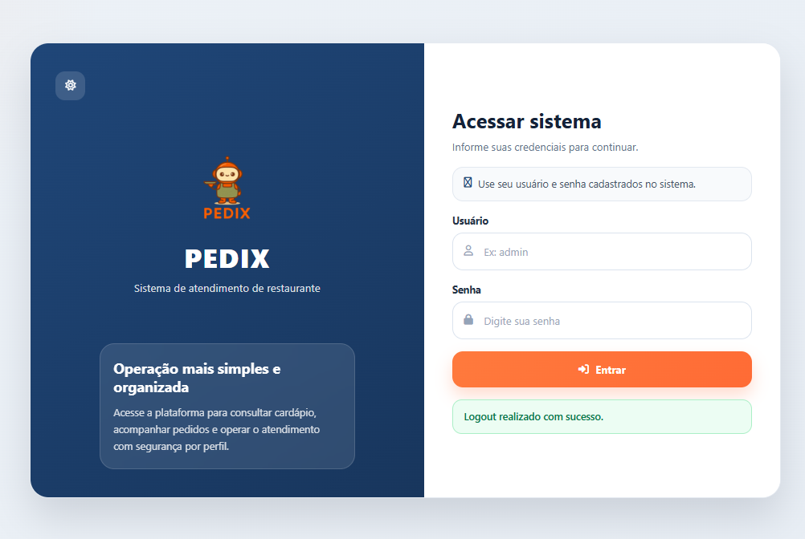
  <br>
  <em>Tela de autenticação do painel administrativo</em>
</p>

<p align="center">
  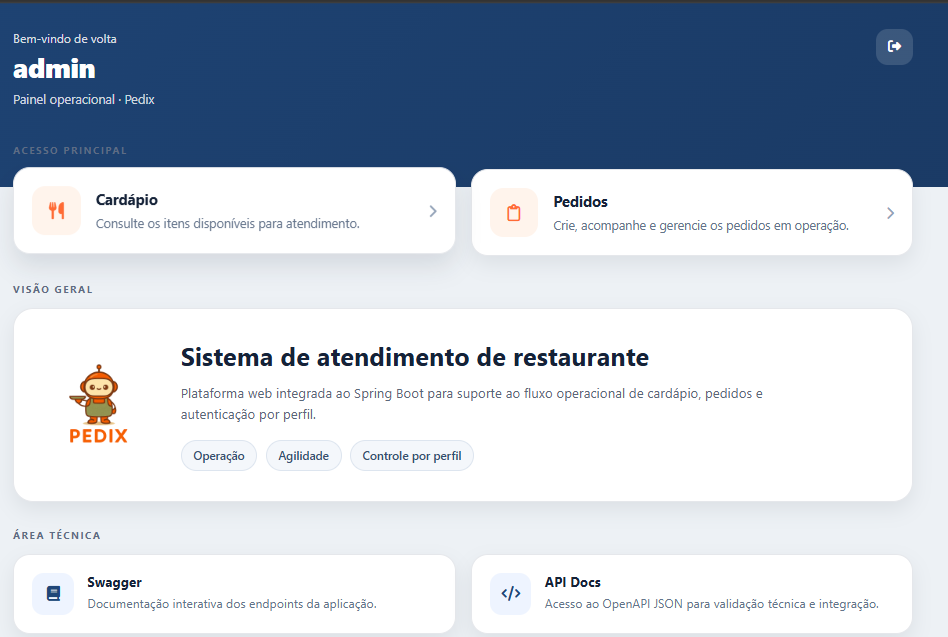
  <br>
<em>Painel administrativo com acesso às funcionalidades de gestão operacional e à área técnica da aplicação</em>
</p>

<p align="center">
  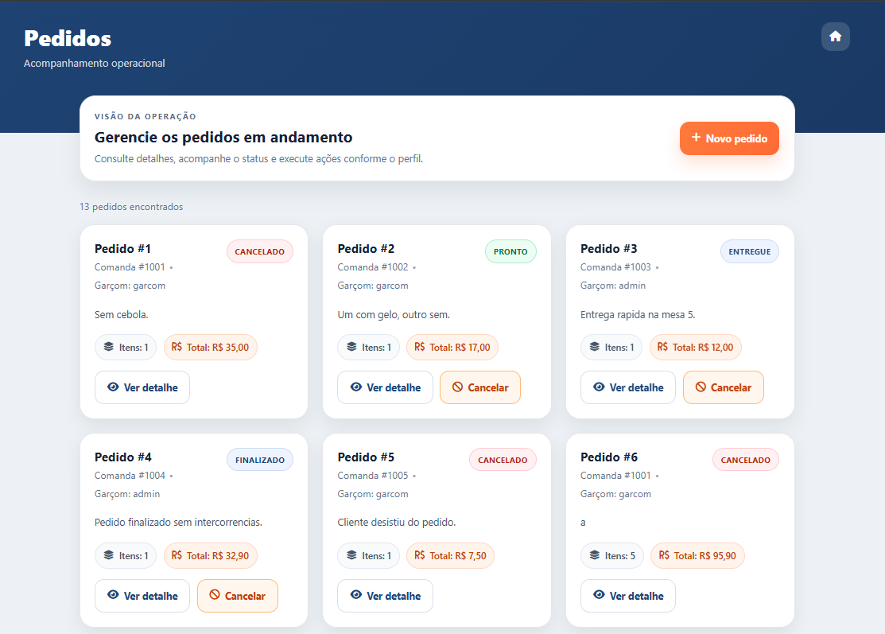
  <br>
<em>Gestão de pedidos pelo Administrador, com acesso a detalhes, criação e cancelamento</em>
</p>

<p align="center">
  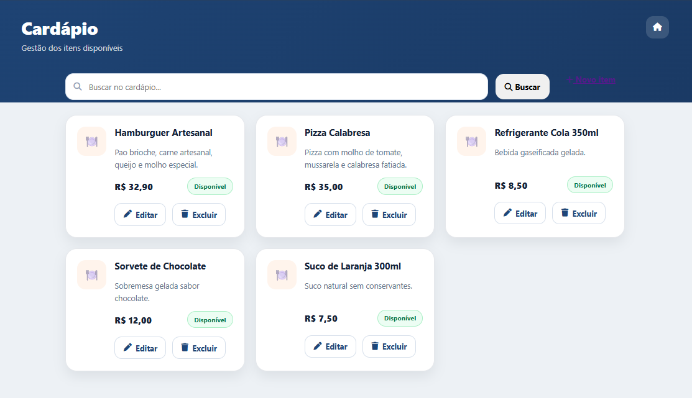
  <br>
<em>Gestão administrativa do cardápio, com operações de cadastro, edição e exclusão de itens</em>
</p>

<p align="center">
  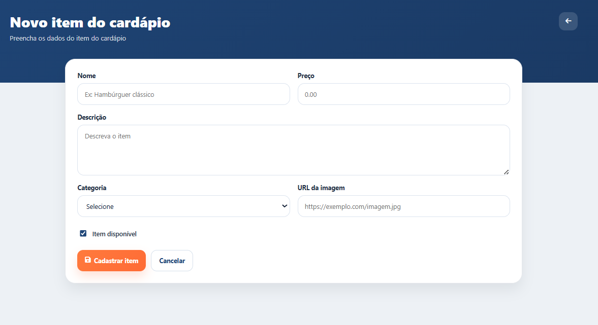
  <br>
  <em>Cadastro de novos itens no cardápio</em>
</p>

---

### Painel Web do Garçom

<p align="center">
  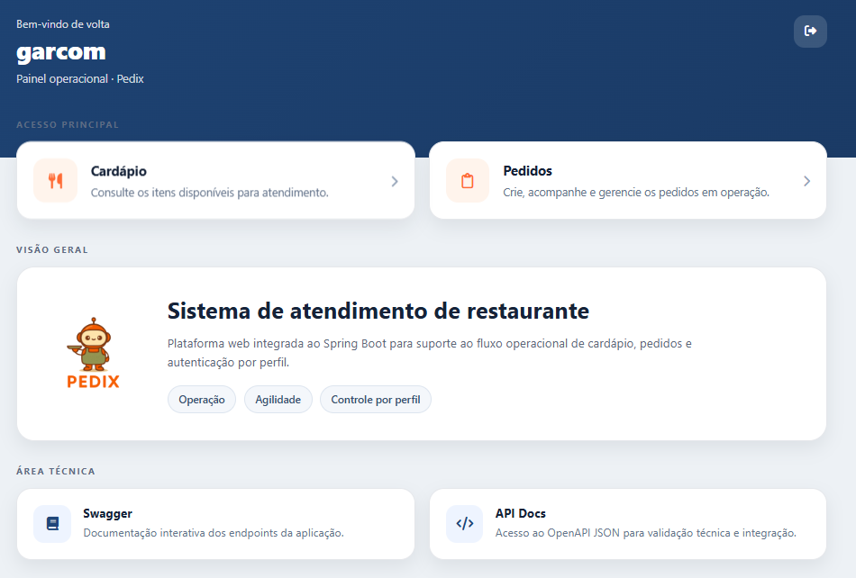
  <br>
<em>Painel do perfil Garçom com acesso restrito às funcionalidades operacionais de atendimento</em>
</p>

<p align="center">
  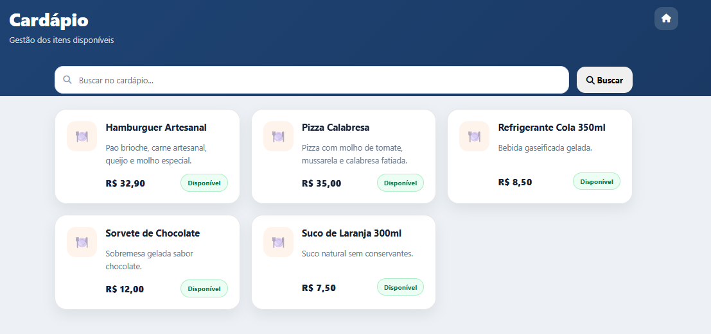
  <br>
<em>Visualização do cardápio disponível para o perfil Garçom, sem permissões de edição ou exclusão</em>
</p>

<p align="center">
  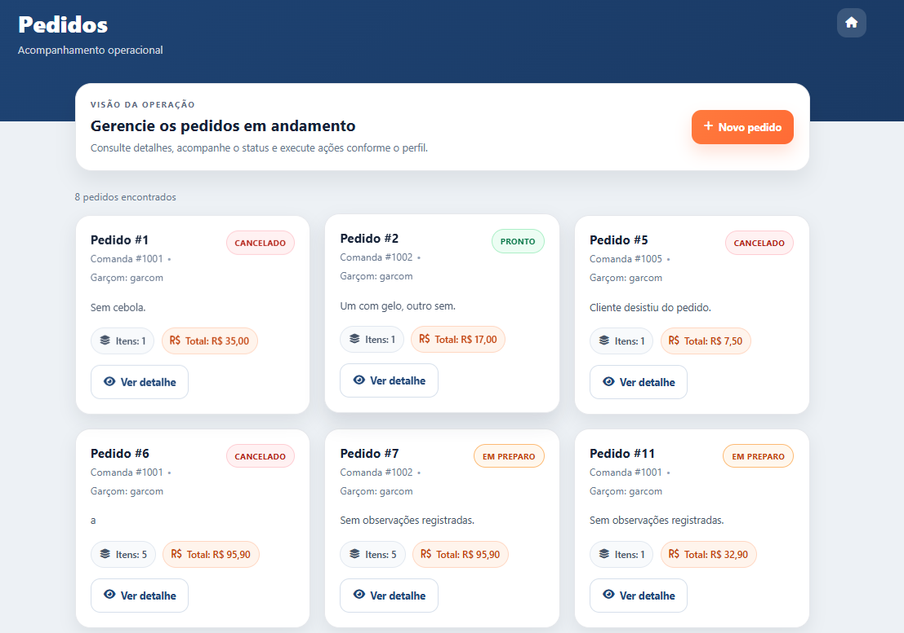
  <br>
<em>Consulta de detalhes e lançamento de novos pedidos pelo perfil Garçom</em>
</p>

<p align="center">
  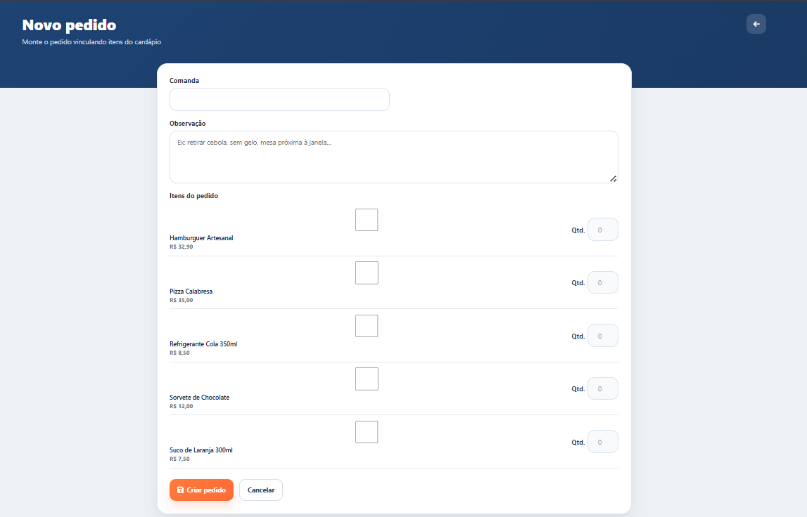
  <br>
  <em>Tela de inclusão de novo pedido no sistema</em>
</p>

---

## 📅 Cronograma de Evolução e Entregas do Projeto

| Data       | Atividade                                                       | Responsável          | Status        |
| ---------- | --------------------------------------------------------------- | -------------------- | ------------- |
| 20/09/2025 | Configuração inicial do projeto (Spring Boot + Oracle)          | **Alane Rocha**      | ✅ Concluído   |
| 21/09/2025 | Implementação do CRUD de `ItemCardapio`                         | **Alane Rocha**      | ✅ Concluído   |
| 23/09/2025 | Criação do `PedidoController` e integração com Oracle           | **Alane Rocha**      | ✅ Concluído   |
| 25/09/2025 | Testes iniciais e documentação Swagger                          | **Alane Rocha**      | ✅ Concluído   |
| 28/10/2025 | Implementação do HATEOAS e refatoração dos controllers          | **Alane Rocha**      | ✅ Concluído   |
| 28/10/2025 | Atualização do README, coleção Postman e geração das evidências | **Alane Rocha**      | ✅ Concluído   |
| 31/10/2025 | Geração dos diagramas e gravação do vídeo de apresentação       | **Alane Rocha**      | ✅ Concluído   |
| 05/11/2025 | Testes finais e validação completa do sistema                   | **Equipe CodeGirls** | ✅ Concluído   |
| 01/04/2026 | Implementação do painel web administrativo                      | **Alane Rocha**      | ✅ Concluído   |
| 02/04/2026 | Implementação do painel operacional do Garçom                   | **Alane Rocha**      | ✅ Concluído   |
| 03/04/2026 | Aplicação de segregação de acesso por perfil (Admin/Garçom)     | **Alane Rocha**      | ✅ Concluído   |
| 04/04/2026 | Restrição de acesso à Área Técnica por perfil                   | **Alane Rocha**      | ✅ Concluído   |
| 07/04/2026 | Refinamento visual e responsividade das interfaces web          | **Alane Rocha**      | ✅ Concluído   |
| 08/04/2026 | Organização de assets e evidências no repositório              | **Alane Rocha**      | ✅ Concluído   |
| 09/04/2026 | Atualização completa do README com novas interfaces             | **Alane Rocha**      | ✅ Concluído   |
| 10/04/2026 | Revisão final da Sprint 3 e preparação para entrega             | **Equipe CodeGirls** | ✅ Concluído   |


## 🧩 Visão Geral e Arquitetura da Solução

A **Pedix** adota princípios de **Clean Architecture**, **Domain-Driven Design (DDD)** e **segregação por camadas**, estruturando a aplicação em módulos distintos para interface web, API REST, regras de negócio e persistência.

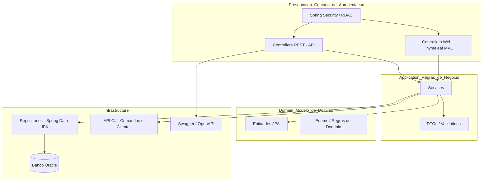
```mermaid
flowchart TD

    subgraph Presentation_Camada_de_Apresentacao
        A[Controllers REST - API]
        W[Controllers Web - Thymeleaf MVC]
        S[Spring Security / RBAC]
    end

    subgraph Application_Regras_de_Negocio
        B[Services]
        G[DTOs / Validations]
    end

    subgraph Domain_Modelo_de_Dominio
        C[Entidades JPA]
        H[Enums / Regras de Domínio]
    end

    subgraph Infrastructure
        D[Repositories - Spring Data JPA]
        E[(Banco Oracle)]
        F[API C# - Comandas e Clientes]
        O[Swagger / OpenAPI]
    end

    A --> B
    W --> B
    S --> W
    S --> A
    B --> C
    B --> D
    B --> G
    B --> F
    D --> E
    A --> O
    
```


## 🔗 Implementação do HATEOAS

A camada REST da Pedix API utiliza o módulo **Spring HATEOAS** para enriquecer os recursos retornados com links de navegação entre endpoints relacionados.

Cada entidade exposta pela API (como `ItemCardapio` e `Pedido`) é empacotada em um `EntityModel<>`, contendo links que permitem navegação contextual entre recursos e operações disponíveis.

Exemplo de implementação:

```
EntityModel<ItemCardapio> model = EntityModel.of(item,
    linkTo(methodOn(ItemCardapioController.class).buscarPorId(item.getId())).withSelfRel(),
    linkTo(methodOn(ItemCardapioController.class).listar(null)).withRel("todos_itens")
);
```

* Com isso, o cliente pode navegar entre os recursos sem conhecer previamente as URIs.*


## 🏗️ Camadas e Responsabilidades

A arquitetura da Pedix segue uma separação em camadas bem definidas, promovendo baixo acoplamento, alta coesão e segregação clara de responsabilidades entre interface, regras de negócio e persistência.

| Camada | Pacote / Tecnologia | Responsabilidade |
|--------|---------------------|------------------|
| **Apresentação REST** | `com.pedix.api.controller.api` | Define os endpoints REST da aplicação, expondo recursos como `/api/item-cardapio` e `/api/pedidos`, responsáveis por receber requisições HTTP e delegar o processamento às camadas internas. |
| **Apresentação Web** | `com.pedix.api.controller.web` | Controla as interfaces server-side renderizadas (Thymeleaf), responsáveis pelo painel administrativo e operacional dos perfis Admin e Garçom. |
| **Aplicação / Negócio** | `com.pedix.api.service` | Implementa regras de negócio, validações funcionais, orquestra entidades e coordena o fluxo entre controladores e persistência. |
| **Domínio** | `com.pedix.api.domain` | Contém entidades JPA e enums que representam o modelo de negócio, como `ItemCardapio`, `Pedido`, `PedidoItem`, `StatusPedido` e `CategoriaItem`. |
| **Persistência / Infraestrutura** | `com.pedix.api.repository` | Gerencia a persistência dos dados utilizando Spring Data JPA e integração com banco Oracle. |
| **Segurança** | `Spring Security` | Responsável pela autenticação, autorização e segregação de permissões entre os perfis Administrador e Garçom. |
| **Integrações Externas** | `REST API em .NET` | Integração arquitetural com serviços complementares do ecossistema Pedix, como módulos de comandas, mesas e clientes. |

## ⚙️ Tecnologias Utilizadas

| Categoria | Tecnologia            | Uso Principal |
|----------|-----------------------|---------------|
| Linguagem | 📦 Java 17             | Linguagem principal de desenvolvimento backend da aplicação. |
| Framework Backend | 🌱 Spring Boot 3      | Framework principal para construção da aplicação e gerenciamento do ecossistema Spring. |
| Persistência | 🗄️ JPA / Hibernate   | Mapeamento Objeto-Relacional (ORM) e gerenciamento de entidades persistentes. |
| Banco de Dados | 💾 Oracle Database         | Armazenamento persistente e relacional dos dados da aplicação. |
| Segurança | 🔐 Spring Security    | Controle de autenticação, autorização e segregação de acesso por perfil. |
| Frontend Server-Side | 🖥️ Thymeleaf         | Renderização das interfaces web administrativas e operacionais no servidor. |
| Documentação API | 📖 Swagger / OpenAPI  | Geração automática e navegação da documentação técnica da API REST. |
| Utilitário | ✨ Lombok              | Redução de código boilerplate (getters, setters, builders, construtores). |
| Build / Dependências | 🛠️ Maven             | Gerenciamento de dependências e ciclo de build do projeto. |
| Testes Manuais | 📬 Postman / Insomnia | Validação funcional e testes exploratórios dos endpoints REST. |

## 📂 Estrutura do Projeto

```text
pedix-api/
├── .idea/                              → Configurações do IntelliJ IDEA
├── .mvn/                               → Arquivos de suporte do Maven Wrapper
│
├── docs/                               → Documentação e evidências do projeto
│   ├── cronograma/
│   │   └── Cronograma-java-advanced.pdf        → Cronograma macro do projeto
│   │
│   ├── diagramas/
│   │   ├── diagrama-classes-pedix.png          → Diagrama de classes UML
│   │   └── diagrama-mer-pedix.png              → Modelo Entidade-Relacionamento (MER)
│   │
│   └── imagens/
│       ├── colecao-postman/                    → Evidências visuais dos testes da API REST
│       │   ├── 1-GET-home.png
│       │   ├── 2-GET-item-cardapio.png
│       │   ├── 3-GET-item-cardapio-ID.png
│       │   ├── 4-POST-item-cardapio.png
│       │   ├── 5-PUT-item-cardapio-ID.png
│       │   ├── 6-DELETE-item-cardapio-ID.png
│       │   ├── 7-GET-listar-pedidos.png
│       │   ├── 8-GET-Listar-pedidos-ID.png
│       │   ├── 9-GET-listar-pedido-comandaID.png
│       │   ├── 10-POST-cria-pedido-vinculado-comanda.png
│       │   ├── 11-PUT-Atualiza-status-pedido.png
│       │   ├── 12-DELETE-pedido-ID.png
│       │   ├── 13-GET-teste-erro-404.png
│       │   └── 14-POST-teste-erro-400.png
│       │
│       └── interface-web/                     → Evidências das interfaces web da aplicação
│           ├── login_pedix.png
│           ├── home_admin.png
│           ├── home_garcon.png
│           ├── cardapio_admin.png
│           ├── cardapio_garcon.png
│           ├── item_novo_admin.png
│           ├── pedido_admin.png
│           ├── pedido_garcon.png
│           └── novo_pedido_admin_garcon.png
│
├── testes/                             → Coleções de teste/exportações Postman
│   ├── pedix_api_postman._v1.json
│   └── pedix_api_postman._v2.json
│
├── src/
│   ├── main/
│   │   ├── java/com/pedix/api/
│   │   │
│   │   │   ├── config/                        → Configurações globais da aplicação
│   │   │   │   ├── OpenAPIConfig.java
│   │   │   │   └── SecurityConfig.java
│   │   │   │
│   │   │   ├── controller/
│   │   │   │   ├── api/                       → Endpoints REST da aplicação
│   │   │   │   │   ├── ApiHomeController.java
│   │   │   │   │   ├── ItemCardapioController.java
│   │   │   │   │   ├── PedidoController.java
│   │   │   │   │   └── PedidoItemController.java
│   │   │   │   │
│   │   │   │   └── web/                       → Controllers MVC / Thymeleaf
│   │   │   │       ├── AccessDeniedController.java
│   │   │   │       ├── CardapioWebController.java
│   │   │   │       ├── HomeController.java
│   │   │   │       └── PedidoWebController.java
│   │   │   │
│   │   │   ├── domain/                        → Modelo de domínio / entidades JPA
│   │   │   │   ├── enums/
│   │   │   │   │   ├── CategoriaItem.java
│   │   │   │   │   ├── PerfilUsuario.java
│   │   │   │   │   └── StatusPedido.java
│   │   │   │   ├── ItemCardapio.java
│   │   │   │   ├── Pedido.java
│   │   │   │   └── PedidoItem.java
│   │   │   │
│   │   │   ├── dto/                           → Objetos de transferência de dados
│   │   │   │   ├── ItemCardapioDTO.java
│   │   │   │   ├── MensagemResponse.java
│   │   │   │   ├── PedidoDTO.java
│   │   │   │   ├── PedidoItemDTO.java
│   │   │   │   ├── PedidoItemRequestDTO.java
│   │   │   │   ├── PedidoItemResponseDTO.java
│   │   │   │   └── PedidoResponseDTO.java
│   │   │   │
│   │   │   ├── exception/                     → Tratamento global de exceções
│   │   │   │   └── GlobalExceptionHandler.java
│   │   │   │
│   │   │   ├── repository/                    → Repositórios JPA
│   │   │   │   ├── ItemCardapioRepository.java
│   │   │   │   ├── PedidoItemRepository.java
│   │   │   │   └── PedidoRepository.java
│   │   │   │
│   │   │   ├── security/                      → Serviços auxiliares de autenticação
│   │   │   │   └── CustomUserDetailsService.java
│   │   │   │
│   │   │   ├── service/                       → Regras de negócio / orquestração
│   │   │   │   ├── ItemCardapioService.java
│   │   │   │   ├── PedidoItemService.java
│   │   │   │   └── PedidoService.java
│   │   │   │
│   │   │   └── PedixApplication.java          → Classe principal do Spring Boot
│   │   │
│   │   └── resources/
│   │       ├── db.migration/                  → Scripts versionados Flyway
│   │       │   ├── V1__create_tables.sql
│   │       │   └── V2__insert_data.sql
│   │       │
│   │       ├── static/
│   │       │   ├── css/
│   │       │   │   └── styles.css
│   │       │   └── images/
│   │       │       └── pedix-mascot.png
│   │       │
│   │       ├── templates/                     → Views Thymeleaf
│   │       │   ├── cardapio/
│   │       │   │   ├── form.html
│   │       │   │   └── lista.html
│   │       │   │
│   │       │   ├── pedidos/
│   │       │   │   ├── detalhe.html
│   │       │   │   ├── form.html
│   │       │   │   └── lista.html
│   │       │   │
│   │       │   ├── 403.html
│   │       │   ├── home.html
│   │       │   └── login.html
│   │       │
│   │       └── application.properties         → Configurações da aplicação
│   │
│   └── test/                                  → Testes automatizados
│
├── target/                            → Artefatos gerados no build Maven
├── pom.xml                            → Dependências e configuração do projeto
├── README.md                          → Documentação principal do repositório
├── .gitignore                         → Arquivos ignorados pelo Git
└── .gitattributes                     → Configuração de atributos Git
```


## 🛠 Funcionalidades

A aplicação **Pedix** oferece as seguintes funcionalidades principais:

- 🍽️ **Gestão de Cardápio** — cadastro, listagem, edição e exclusão de itens do cardápio pelo perfil Administrador.
- 👀 **Visualização Operacional do Cardápio** — consulta dos itens disponíveis pelo perfil Garçom, sem permissão de manutenção.
- 🧾 **Gestão de Pedidos** — criação, consulta detalhada e acompanhamento de pedidos vinculados ao fluxo operacional do restaurante.
- 🔄 **Atualização de Status de Pedidos** — alteração do status operacional dos pedidos (`EM_PREPARO`, `PRONTO`, `ENTREGUE`, `CANCELADO`).
- ❌ **Cancelamento Controlado de Pedidos** — funcionalidade restrita ao perfil Administrador.
- 🔐 **Controle de Acesso por Perfil** — segregação de permissões entre usuários Administrador e Garçom via Spring Security.
- 🖥️ **Painel Web Administrativo e Operacional** — interface web server-side renderizada com Thymeleaf para operação do sistema.
- 📖 **Documentação Técnica da API** — Swagger UI e OpenAPI Docs disponíveis em área técnica restrita ao Administrador.
- 🔗 **API REST com HATEOAS** — respostas enriquecidas com hipermídia para navegação entre recursos relacionados.
- 🧱 **Persistência em Banco Oracle** — armazenamento relacional seguro e consistente dos dados da aplicação.
- 🛫 **Versionamento de Banco com Flyway** — controle versionado e automatizado das migrações estruturais da base de dados.

## 🌐 URLs Principais da Aplicação

Antes de utilizar os recursos da plataforma, é possível acessar os principais endpoints técnicos e funcionais do sistema:

| Finalidade | URL | Descrição |
|-----------|-----|-----------|
| **🏠 Home da Aplicação** | `http://localhost:8080/home` | Página inicial autenticada da aplicação, utilizada como painel principal conforme perfil do usuário. |
| **📖 Swagger UI** | `http://localhost:8080/swagger-ui/index.html` | Documentação técnica interativa da API REST, disponível apenas para usuários com perfil Administrador. |
| **📄 API Docs OpenAPI** | `http://localhost:8080/v3/api-docs` | Especificação OpenAPI em JSON para integração e inspeção técnica dos endpoints. |

###  🚀  Endpoints da API Pedix

## 🧭 Endpoint HATEOAS – /home

📍 URL: http://localhost:8080/home

🔍 Exemplo de Resposta JSON

```
{
  "mensagem": "API Pedix está rodando! Acesse o Swagger UI ou as rotas principais.",
  "_links": {
    "self": { "href": "http://localhost:8080/home" },
    "pedidos": { "href": "http://localhost:8080/api/pedido" },
    "cardapio": {
      "href": "http://localhost:8080/api/item-cardapio{?categoria}",
      "templated": true
    },
    "swagger-ui": { "href": "/swagger-ui/index.html" }
  }
}

```
> O endpoint /home serve como ponto de entrada da API, retornando mensagem de status e links navegáveis para os principais recursos.

## 📦 Cardápio — ItemCardápio
| Método   | Endpoint                             | Descrição                                                    | Exemplo de uso                                                                                                     |
| :------- | :----------------------------------- | :----------------------------------------------------------- | :----------------------------------------------------------------------------------------------------------------- |
| `GET`    | `/api/item-cardapio`                 | Lista todos os itens disponíveis no cardápio.                | [http://localhost:8080/api/item-cardapio](http://localhost:8080/api/item-cardapio)                                 |
| `GET`    | `/api/item-cardapio?categoria=PRATO` | Filtra itens por categoria (`PRATO`, `BEBIDA`, `SOBREMESA`). | [http://localhost:8080/api/item-cardapio?categoria=PRATO](http://localhost:8080/api/item-cardapio?categoria=PRATO) |
| `GET`    | `/api/item-cardapio/{id}`            | Busca um item específico pelo ID.                            | [http://localhost:8080/api/item-cardapio/1](http://localhost:8080/api/item-cardapio/1)                             |
| `POST`   | `/api/item-cardapio`                 | Cria um novo item do cardápio.                               | —                                                                                                                  |
| `PUT`    | `/api/item-cardapio/{id}`            | Atualiza os dados de um item existente.                      | —                                                                                                                  |
| `DELETE` | `/api/item-cardapio/{id}`            | Exclui um item do cardápio.                                  | —                                                                                                                  |


## 🛒 Pedido
| Método   | Endpoint                                | Descrição                                        | Exemplo de uso                                                                                 |
| :------- | :-------------------------------------- | :----------------------------------------------- |:-----------------------------------------------------------------------------------------------|
| `GET`    | `/api/pedido`                           | Lista **todos os pedidos** cadastrados.          | [http://localhost:8080/api/pedido](http://localhost:8080/api/pedido)                           |
| `GET`    | `/api/pedido/{id}`                      | Busca um pedido específico pelo ID.              | [http://localhost:8080/api/pedido/1](http://localhost:8080/api/pedido/1)                       |
| `GET`    | `/api/pedido/comanda/{comandaId}`       | Lista todos os pedidos vinculados a uma comanda. | [http://localhost:8080/api/pedido/comanda/1001](http://localhost:8080/api/pedido/comanda/1001) |
| `POST`   | `/api/pedido/comanda/{comandaId}`       | Cria um novo pedido vinculado a uma comanda.     | —                                                                                              |
| `PUT`    | `/api/pedido/{id}/status?status=PRONTO` | Atualiza o status de um pedido existente.        | —                                                                                              |
| `DELETE` | `/api/pedido/{id}`                      | Remove um pedido existente pelo ID.              | [http://localhost:8080/api/pedido/3](http://localhost:8080/api/pedido/3)                       |


## 🧾 Item de Pedido — PedidoItem

| Método   | Endpoint                | Descrição                                | Exemplo                                                                            |
| -------- | ----------------------- | ---------------------------------------- | ---------------------------------------------------------------------------------- |
| `GET`    | `/api/pedido-item`      | Lista todos os itens de pedido.          | [http://localhost:8080/api/pedido-item](http://localhost:8080/api/pedido-item)     |
| `GET`    | `/api/pedido-item/{id}` | Busca um item de pedido pelo ID.         | [http://localhost:8080/api/pedido-item/1](http://localhost:8080/api/pedido-item/1) |
| `POST`   | `/api/pedido-item`      | Cria um novo item vinculado a um pedido. | —                                                                                  |
| `PUT`    | `/api/pedido-item/{id}` | Atualiza um item de pedido existente.    | —                                                                                  |
| `DELETE` | `/api/pedido-item/{id}` | Remove um item de pedido.                | —                                                                                  |


## 🧪 Testes e Exemplos de Consumo da API

A aplicação disponibiliza coleções **Postman versionadas** com exemplos completos de requisição e resposta para validação funcional dos endpoints REST.

### 📂 Coleções Disponíveis
- 📬 `pedix_api_postman_v1.json`
- 📬 `pedix_api_postman_v2.json`

### ✅ Cobertura dos Testes
- 🍽️ CRUD de Itens do Cardápio
- 🧾 CRUD de Pedidos
- 🛒 CRUD de Itens de Pedido
- ⚠️ Testes de validação e tratamento de erros
- 🔗 Exemplos de respostas com HATEOAS

### 🖼️ Evidências Visuais
Além das coleções Postman, os prints das execuções e evidências dos testes encontram-se em:

`/docs/imagens/colecao-postman`


## 🛡️ Validação Funcional

A aplicação utiliza **Jakarta Bean Validation** para garantir integridade e consistência dos dados recebidos nos endpoints REST e formulários web.

### ✅ Principais Anotações Utilizadas
- `@NotNull` — garante preenchimento de campos obrigatórios
- `@NotBlank` — impede strings vazias ou compostas apenas por espaços
- `@Positive` — valida valores numéricos positivos
- `@Size` — restringe tamanho mínimo e máximo de campos textuais

## 🗃️ Migrações e Inicialização do Banco de Dados

A aplicação utiliza **Flyway** para versionamento e gerenciamento automatizado da estrutura do banco Oracle.

As migrações são executadas automaticamente na inicialização da aplicação, garantindo consistência estrutural entre ambientes.

### 📂 Scripts de Migração
- `V1__create_tables.sql` — criação das tabelas, sequences e triggers da aplicação
- `V2__insert_data.sql` — carga inicial de dados para testes e homologação

### 📌 Estruturas Persistidas
- `ITEM_CARDAPIO`
- `PEDIDO`
- `PEDIDO_ITEM`

### ⚙️ Recursos de Banco Implementados
- Sequences para geração de identificadores
- Triggers de auto incremento no Oracle
- Relacionamentos e constraints de integridade referencial
- Dados seed iniciais para ambiente de desenvolvimento/testes

## 📋 Resumo Estrutural
| Tabela          | Descrição                                        | Chave Primária | Relações                                                               |
| :-------------- | :----------------------------------------------- | :------------- | :--------------------------------------------------------------------- |
| `ITEM_CARDAPIO` | Itens do cardápio (pratos, bebidas, sobremesas). | `id`           | —                                                                      |
| `PEDIDO`        | Pedido de uma comanda, com data e total.         | `id`           | 1:N → `PEDIDO_ITEM`                                                    |
| `PEDIDO_ITEM`   | Itens que pertencem a um pedido específico.      | `id`           | FK `pedido_id` → `PEDIDO` <br> FK `item_cardapio_id` → `ITEM_CARDAPIO` |


## 🚀 Como Rodar a Aplicação

### 1️⃣ Clonar o Repositório

```bash
git clone https://github.com/alanerochaa/pedix-api.git
cd pedix-api
```

---

### 2️⃣ Configurar Variáveis de Ambiente / Banco Oracle

Defina as credenciais de conexão com o banco Oracle utilizadas pela aplicação:

```env
DB_URL=jdbc:oracle:thin:@oracle.fiap.com.br:1521:ORCL
DB_USER=RMXXXXXX
DB_PASSWORD=XXXXXX
```

> Caso utilize `application.properties` local, configure os mesmos valores manualmente.

---

### 3️⃣ Executar a Aplicação

```bash
mvn clean install
mvn spring-boot:run
```

> Durante a inicialização, o Flyway executará automaticamente as migrations do banco de dados.

---

### 4️⃣ Acessar a Aplicação

| Recurso | URL |
|--------|-----|
| 🏠 Aplicação Web | `http://localhost:8080/home` |
| 📖 Swagger UI | `http://localhost:8080/swagger-ui/index.html` |
| 📄 OpenAPI Docs | `http://localhost:8080/v3/api-docs` |

---

### 5️⃣ Credenciais de Acesso

A aplicação possui autenticação baseada em perfil de usuário.

#### 👑 Administrador
```text
Usuário: admin
Senha: admin123
```

#### 🍽️ Garçom
```text
Usuário: garcom
Senha: garcom123
```

> O acesso à documentação técnica (Swagger / API Docs) é restrito ao perfil **Administrador**.


## 📊 Diagramas

### 🌐 Diagrama de Contexto Arquitetural

Representa a visão macro do ecossistema Pedix, evidenciando a separação de responsabilidades entre os módulos da solução e o compartilhamento do banco Oracle centralizado.

```text
          ┌────────────────────────────┐
          │        Banco Oracle        │
          │  (Modelo de Dados Único)   │
          └────────────┬───────────────┘
                       │
     ┌─────────────────┴───────────────────┐
     │                                     │
┌───────────────┐                 ┌─────────────────┐
│ API Principal │                 │ API Pedix Java  │
│   (C#/.NET)   │                 │ (Spring Boot)   │
│---------------│                 │-----------------│
│ Cliente       │                 │ ItemCardapio    │
│ Garçom        │                 │ Pedido          │
│ Mesa          │                 │ PedidoItem      │
│ Comanda       │                 │                 │
└───────────────┘                 └─────────────────┘
```
### ⚙️ Distribuição de Responsabilidades
* 🖥️ API Principal (C#/.NET): responsável pela gestão operacional do restaurante, incluindo Clientes, Garçons, Mesas e Comandas.
* ☕ API Complementar (Java/Spring Boot): responsável pela gestão de Cardápio e Pedidos, integrando-se ao ecossistema via banco Oracle compartilhado.
    
## 💡 Observação:

A API Java implementa e manipula as entidades: ITEM_CARDAPIO, PEDIDO e PEDIDO_ITEM.

As demais entidades (CLIENTE, GARCOM, MESA, COMANDA) pertencem à API principal em C#.

O diagrama abaixo representa o modelo conceitual completo do banco de dados **Oracle** utilizado pela aplicação **Pedix**.  
Ele demonstra as entidades, atributos e relacionamentos que sustentam o funcionamento das APIs Java e C#

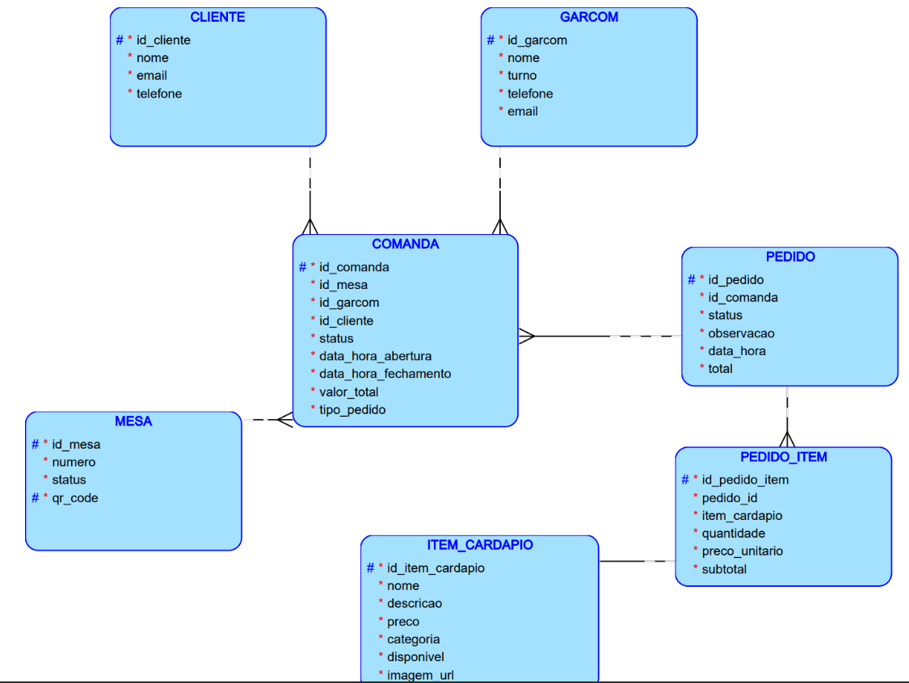


### 🧱 Diagrama de Classes (UML)
Mostra as classes principais da aplicação Java, seus atributos e relacionamentos, além dos *enums* utilizados (`CategoriaItem`, `StatusPedido`).

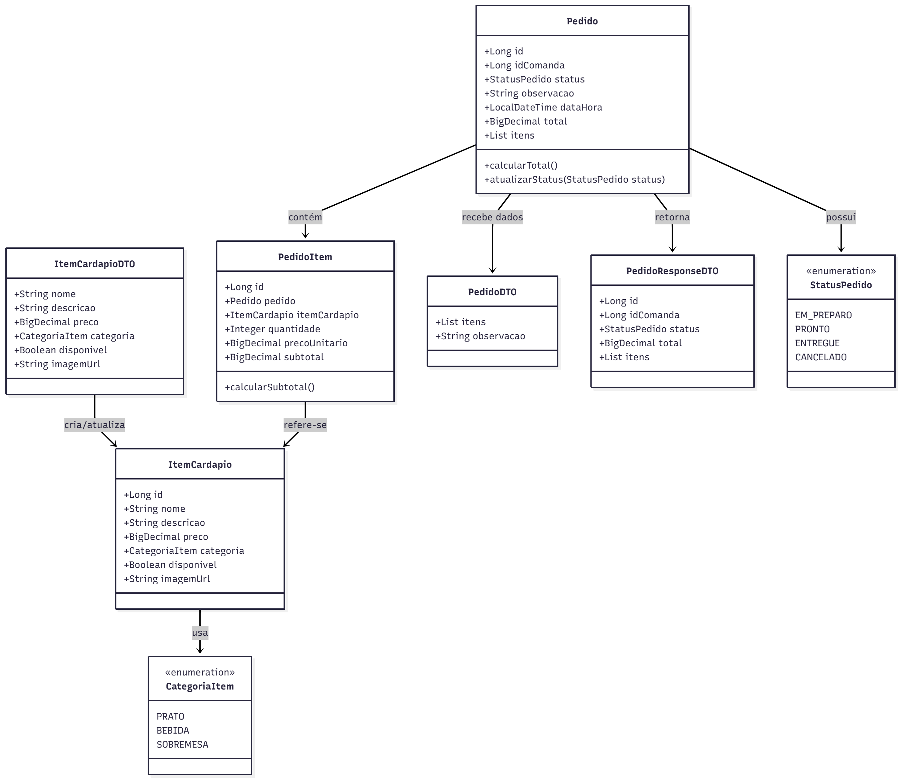

---

## 🧪 Testes no Postman

A coleção completa de testes da API está disponível para importação no **Postman**.  
O arquivo inclui todos os endpoints (`GET`, `POST`, `PUT`, `DELETE`) com exemplos de requisição e resposta, além de cenários de erro e exceções tratadas globalmente (`404`, `400`).

## Coleções Postman por Sprint

📌 **Sprint 1 – Testes dos Endpoints Básicos (CRUD + REST Nível 1)**  
📄 **[Baixar coleção Sprint 1](docs/testes/pedix_api_postman._v1.json)**

📌 **Sprint 2 – Testes da Evolução (HATEOAS + maturidade nível 3 + refatorações)**  
📄 **[Baixar coleção Sprint 2](docs/testes/pedix_api_postman._v2.json)**


## 📸 Evidências de Testes da API

A API foi validada por meio de uma coleção completa de testes no Postman, contemplando operações CRUD, fluxos de negócio e cenários de exceção.

### Cobertura Validada
- 🟢 Operações GET / POST / PUT / DELETE
- 🔗 Respostas com HATEOAS
- ⚠️ Tratamento de exceções HTTP 400 / 404
- 🧾 Fluxos completos de Cardápio, Pedido e Item de Pedido

### Artefatos Disponíveis
- 📬 Coleções Postman: `/testes`
- 🖼️ Evidências Visuais: `/docs/imagens/colecao-postman`

✅ **Todos os endpoints foram testados com sucesso**, com respostas esperadas e tratamento global de exceções ativo.

---

## 🎬 Vídeo de Apresentação

O vídeo de apresentação demonstra o funcionamento completo da solução **Pedix**, contemplando a evolução implementada na Sprint 3, incluindo autenticação, controle de acesso por perfil, interface web administrativa e operacional, documentação técnica da API e integração com banco Oracle.

📺 **Assista aqui:** [Apresentação Pedix API - CodeGirls](COLE_AQUI_O_LINK_DO_NOVO_VIDEO)

🧾 O vídeo apresenta:
- Fluxo de autenticação com perfis **Administrador** e **Garçom**
- Navegação pelas interfaces web e segregação de permissões
- Operações de gestão de cardápio e pedidos
- Acesso restrito à área técnica (Swagger / API Docs)
- Execução dos endpoints REST e responses HATEOAS
- Integração persistente com banco Oracle via Flyway
--- 

## 👩‍💻 Integrantes e Responsabilidades

| Nome Completo | RM | Responsabilidade no Projeto | GitHub |
|--------------|----|-----------------------------|--------|
| **Alane Rocha da Silva** | RM561052 | Arquitetura e desenvolvimento da API Java/Spring Boot, modelagem relacional Oracle, interface web administrativa e documentação técnica | [@alanerochaa](https://github.com/alanerochaa) |
| **Anna Beatriz Bonfim** | RM559561 | Desenvolvimento do aplicativo mobile em React Native e integração com camada IoT | [@annabonfim](https://github.com/annabonfim) |
| **Maria Eduarda Araujo Penas** | RM560944 | Desenvolvimento da API principal em C#, integração entre módulos e DevOps | [@DudaAraujo14](https://github.com/DudaAraujo14) |

<p align="center">
  Desenvolvido com 💜 pela equipe <strong>CodeGirls</strong> — FIAP 2025.
</p>