# 🍽️ Pedix API — Central Técnica de Integração

O **Pedix API** é uma aplicação backend desenvolvida em **Java com Spring Boot**, responsável pela camada de integração técnica e serviços auxiliares do ecossistema Pedix.

A solução foi projetada para oferecer suporte operacional ao aplicativo mobile e aos módulos administrativos da plataforma, disponibilizando endpoints REST para gerenciamento de cardápio, categorias, avaliações, relatórios e histórico operacional.

A arquitetura da aplicação foi construída com foco em:

- Arquitetura RESTful escalável;
- Integração com aplicativo mobile;
- Persistência relacional utilizando Oracle Database;
- Segurança e controle de acesso com Spring Security;
- Versionamento de banco de dados com Flyway;
- Deploy em nuvem utilizando Microsoft Azure;
- Integração contínua e deploy automatizado com GitHub Actions;
- Documentação automatizada via Swagger/OpenAPI;
- Interface web administrativa integrada com Thymeleaf.

O fluxo operacional principal de autenticação, comandas e pedidos encontra-se centralizado na API .NET do ecossistema Pedix, enquanto a API Java atua como serviço secundário de suporte, gestão e integração.

A solução tem como objetivo proporcionar uma gestão digital eficiente para operações de restaurantes, reduzindo falhas operacionais, centralizando informações e melhorando a comunicação entre atendimento, cozinha e administração.

# 🚀 Destaques da Sprint 4

Nesta etapa final do projeto, o ecossistema Pedix evoluiu para uma solução integrada, distribuída e preparada para execução em ambiente de nuvem, consolidando conceitos avançados de backend, segurança, DevOps, integração entre APIs e documentação técnica.

A Sprint 4 teve como foco principal transformar a aplicação em uma plataforma operacional mais próxima de um ambiente real de produção, incorporando deploy cloud, integração contínua, organização arquitetural e integração multidisciplinar entre as disciplinas do semestre.

### Principais Entregas

- Deploy da aplicação Java em ambiente Microsoft Azure App Service
- Integração contínua e deploy automatizado com GitHub Actions (CI/CD)
- Implementação de arquitetura integrada entre Java, .NET, Mobile e MongoDB
- Evolução da interface web administrativa com melhorias de UX/UI
- Expansão das entidades operacionais do sistema
- Implementação de endpoints auxiliares para integração mobile
- Estruturação de documentação técnica da solução
- Integração com Swagger/OpenAPI para documentação automatizada
- Controle de acesso com Spring Security e perfis ADMIN/GARÇOM
- Versionamento de banco de dados com Flyway
- Organização do projeto seguindo arquitetura em camadas
- Estruturação de evidências técnicas, testes e documentação da Sprint 4

---

# 📈 Evolução do Projeto

| Sprint | Evolução |
|--------|-----------|
| Sprint 1 | Estrutura inicial da API, persistência Oracle e CRUD base |
| Sprint 2 | Implementação de DTOs, HATEOAS, tratamento global de exceções e padronização REST |
| Sprint 3 | Spring Security, controle de perfis, interface Web/MVC e evolução operacional |
| Sprint 4 | Deploy cloud, CI/CD, integração multidisciplinar, arquitetura distribuída e consolidação da solução |

---

# 🗓️ Cronograma Macro do Projeto

| Sprint | Período | Objetivos Principais | Entregáveis / Funcionalidades | Status |
|--------|----------|----------------------|--------------------------------|--------|
| **Sprint 1** | 25/09/2025 → 12/10/2025 | Estrutura inicial da solução | Criação da API base, persistência Oracle, CRUD inicial de ItemCardapio e Pedido, documentação Swagger | ✅ Concluído |
| **Sprint 2** | 25/09/2025 → 09/11/2025 | Evolução arquitetural e padronização REST | Implementação de HATEOAS, DTOs, tratamento global de exceções, padronização das respostas da API e melhorias estruturais | ✅ Concluído |
| **Sprint 3** | 06/04/2026 → 12/04/2026 | Segurança e expansão operacional | Implementação de Spring Security, controle de acesso por perfil, interface Web/MVC, dashboard administrativo e evolução operacional do sistema | ✅ Concluído |
| **Sprint 4** | 06/04/2026 → 24/05/2026 | Consolidação da solução e deploy em nuvem | Deploy Azure, GitHub Actions, CI/CD, integração multidisciplinar, documentação técnica, integração mobile, MongoDB e organização final da solução | 🚀 Em Entrega |

## 🖥️ Interfaces do Sistema Pedix

### Controle de Acesso por Perfil

O sistema Pedix implementa segregação de responsabilidades entre os perfis **Administrador** e **Garçom**, garantindo maior controle operacional, segurança de acesso e aderência às permissões definidas para cada funcionalidade.

O perfil **Administrador** é responsável pela gestão do cardápio, podendo cadastrar, editar e excluir itens, além de criar pedidos, visualizar detalhes e cancelar pedidos.

O perfil **Garçom** possui acesso operacional restrito, podendo visualizar os itens disponíveis no cardápio, criar novos pedidos e consultar seus detalhes, sem permissão para alterar cadastros ou cancelar pedidos.

Além das funcionalidades operacionais, o perfil **Administrador** também possui acesso à **Área Técnica** da aplicação, com entrada liberada para **Swagger** e **API Docs**, recursos destinados à validação técnica, consulta de endpoints e apoio à integração.

Já o perfil **Garçom** **não possui acesso** à Área Técnica, mantendo sua atuação restrita às funcionalidades operacionais do sistema.


### Painel Web Administrativo

<p align="center">
  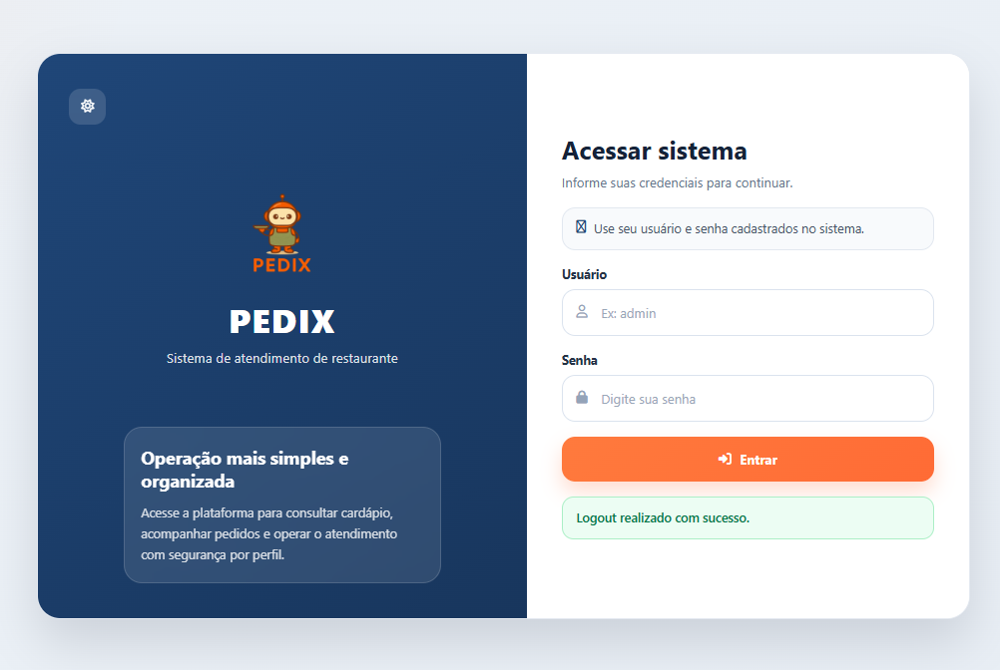
  <br>
  <em>Tela de autenticação do painel administrativo</em>
</p>

<p align="center">
  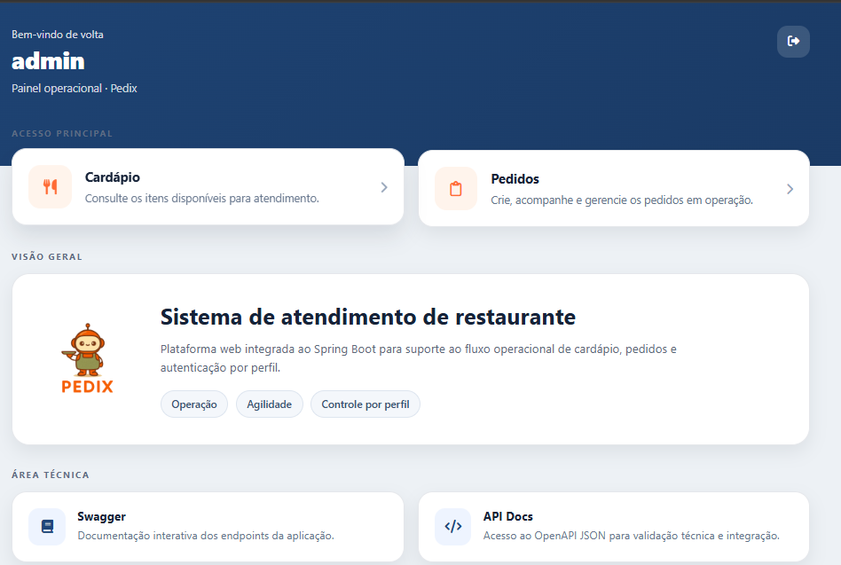
  <br>
<em>Painel administrativo com acesso às funcionalidades de gestão operacional e à área técnica da aplicação</em>
</p>

<p align="center">
  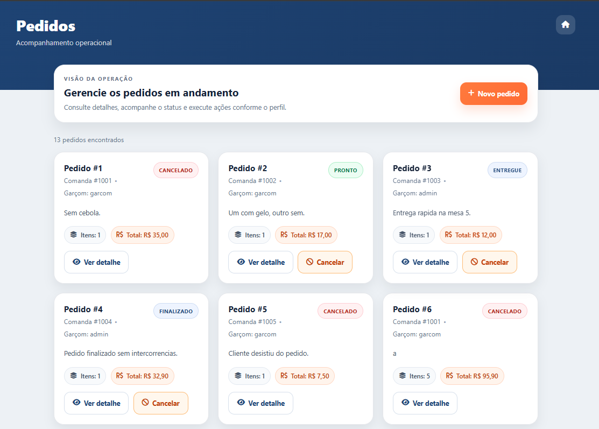
  <br>
<em>Gestão de pedidos pelo Administrador, com acesso a detalhes, criação e cancelamento</em>
</p>

<p align="center">
  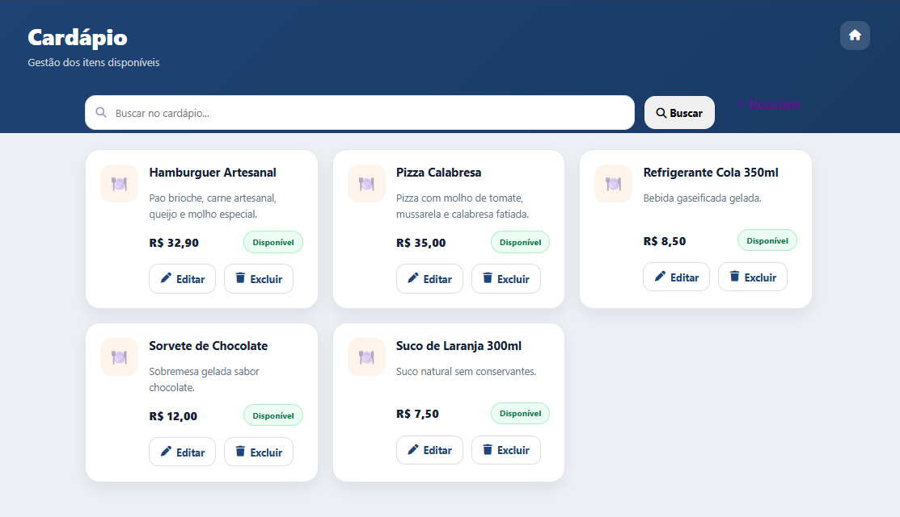
  <br>
<em>Gestão administrativa do cardápio, com operações de cadastro, edição e exclusão de itens</em>
</p>

<p align="center">
  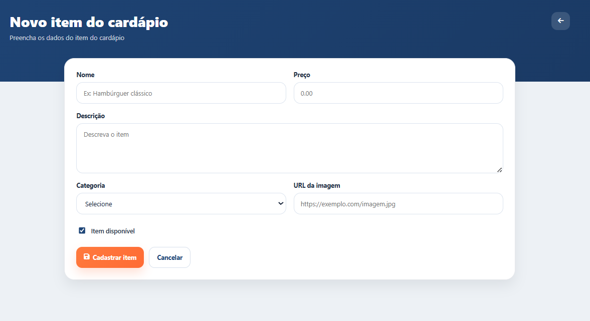
  <br>
  <em>Cadastro de novos itens no cardápio</em>
</p>

---

### Painel Web do Garçom

<p align="center">
  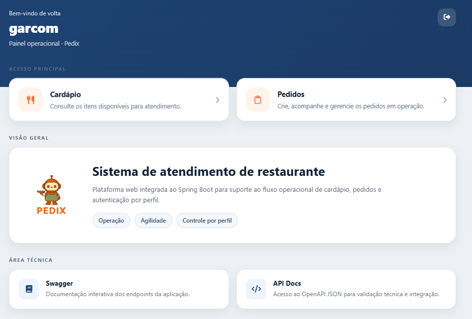
  <br>
<em>Painel do perfil Garçom com acesso restrito às funcionalidades operacionais de atendimento</em>
</p>

<p align="center">
  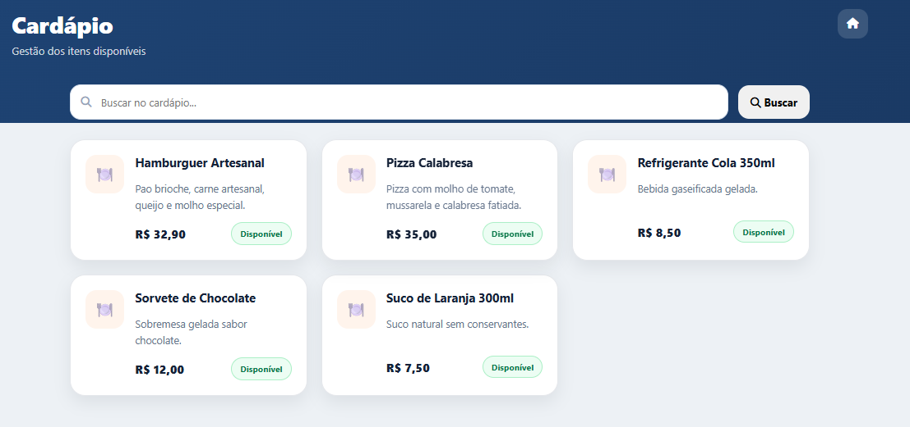
  <br>
<em>Visualização do cardápio disponível para o perfil Garçom, sem permissões de edição ou exclusão</em>
</p>

<p align="center">
  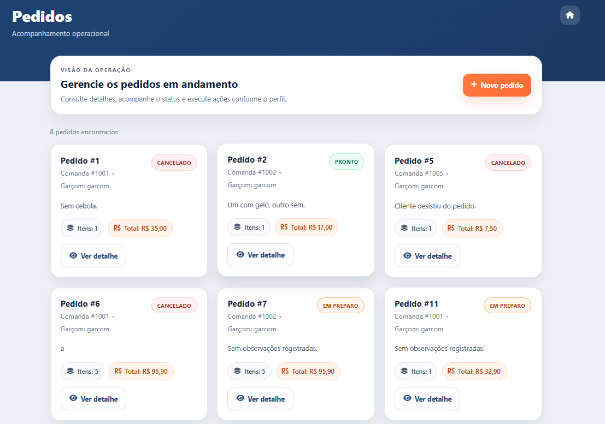
  <br>
<em>Consulta de detalhes e lançamento de novos pedidos pelo perfil Garçom</em>
</p>

<p align="center">
  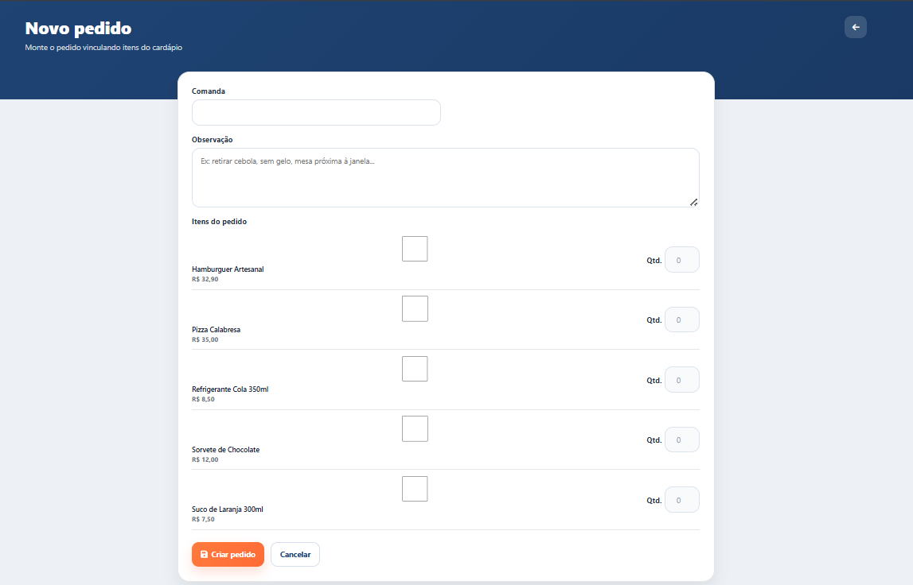
  <br>
  <em>Tela de inclusão de novo pedido no sistema</em>
</p>

---

# ☁️ Infraestrutura Cloud e Deploy Contínuo

A aplicação Pedix API foi publicada em ambiente cloud utilizando Microsoft Azure App Service, permitindo execução online da solução e integração contínua com o repositório GitHub.

A infraestrutura em nuvem foi configurada utilizando runtime Java 17, deploy automatizado via GitHub Actions e monitoramento operacional através dos recursos disponibilizados pela plataforma Azure.

Essa abordagem permitiu aproximar o projeto de um cenário real de produção, consolidando conceitos de DevOps, deploy contínuo e arquitetura distribuída aplicados durante a Sprint 4.

## Recursos Utilizados

- Microsoft Azure App Service
- Runtime Java 17
- GitHub Actions (CI/CD)
- Deploy automatizado
- Ambiente Linux Cloud
- Integração contínua com GitHub

<p align="center">
  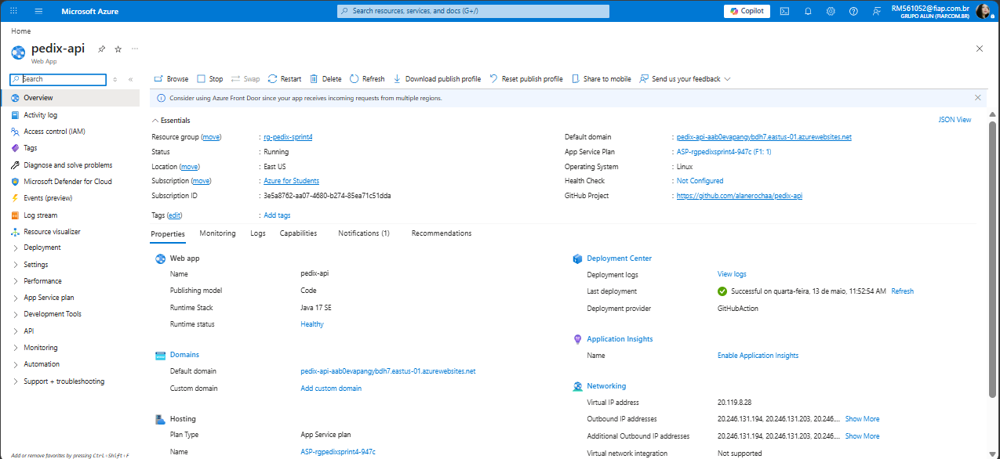
  <br>
  <em>Aplicação Pedix API publicada em ambiente Microsoft Azure App Service</em>
</p>

<p align="center">
  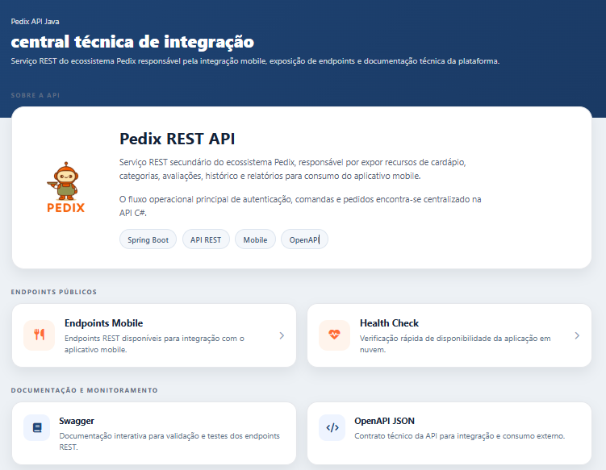
  <br>
  <em>Execução online da aplicação Pedix API em ambiente cloud</em>
</p>

---

## 📅 Cronograma de Evolução e Entregas do Projeto

O desenvolvimento do ecossistema Pedix foi conduzido de forma incremental ao longo das sprints da disciplina, contemplando evolução arquitetural, implementação de funcionalidades, segurança, integração entre sistemas, deploy cloud e organização da documentação técnica.

| Data | Atividade | Responsável | Status |
|------|------------|--------------|---------|
| 20/09/2025 | Configuração inicial do projeto utilizando Spring Boot e Oracle Database | **Alane Rocha** | ✅ Concluído |
| 21/09/2025 | Implementação inicial do CRUD de `ItemCardapio` | **Alane Rocha** | ✅ Concluído |
| 23/09/2025 | Criação do módulo de pedidos e integração com Oracle Database | **Alane Rocha** | ✅ Concluído |
| 25/09/2025 | Estruturação da documentação Swagger/OpenAPI e primeiros testes da API | **Alane Rocha** | ✅ Concluído |
| 28/10/2025 | Implementação de HATEOAS e refatoração estrutural dos controllers | **Alane Rocha** | ✅ Concluído |
| 28/10/2025 | Atualização do README, organização da coleção Postman e geração das evidências técnicas | **Alane Rocha** | ✅ Concluído |
| 31/10/2025 | Geração dos diagramas MER/UML e preparação inicial da apresentação do projeto | **Alane Rocha** | ✅ Concluído |
| 05/11/2025 | Testes integrados e validação funcional da aplicação | **Equipe CodeGirls** | ✅ Concluído |
| 01/04/2026 | Implementação do painel web administrativo utilizando Spring MVC + Thymeleaf | **Alane Rocha** | ✅ Concluído |
| 02/04/2026 | Implementação do painel operacional do perfil Garçom | **Alane Rocha** | ✅ Concluído |
| 03/04/2026 | Aplicação de segregação de acesso por perfil utilizando Spring Security | **Alane Rocha** | ✅ Concluído |
| 04/04/2026 | Restrição de acesso à Área Técnica (Swagger/OpenAPI) por perfil de usuário | **Alane Rocha** | ✅ Concluído |
| 07/04/2026 | Refinamento visual, melhorias de UX/UI e responsividade das interfaces web | **Alane Rocha** | ✅ Concluído |
| 08/04/2026 | Organização das evidências técnicas, assets e documentação complementar no repositório | **Alane Rocha** | ✅ Concluído |
| 09/04/2026 | Atualização completa do README com integração visual das novas funcionalidades | **Alane Rocha** | ✅ Concluído |
| 15/05/2026 | Configuração do deploy cloud da aplicação utilizando Microsoft Azure App Service | **Alane Rocha** | ✅ Concluído |
| 15/05/2026 | Implementação de pipeline CI/CD com GitHub Actions | **Alane Rocha** | ✅ Concluído |
| 16/05/2026 | Integração da arquitetura distribuída entre Java, .NET, Mobile e MongoDB | **Equipe CodeGirls** | ✅ Concluído |
| 17/05/2026 | Organização da documentação técnica da Sprint 4 e consolidação multidisciplinar | **Equipe CodeGirls** | ✅ Concluído |
| 18/05/2026 | Validação final da aplicação em ambiente cloud e revisão operacional do sistema | **Equipe CodeGirls** | ✅ Concluído |
| 19/05/2026 | Revisão final do projeto, evidências técnicas e preparação da entrega oficial | **Equipe CodeGirls** | 🚀 Em andamento |

## 🧩 Visão Geral e Arquitetura da Solução

A solução **Pedix** foi estruturada utilizando princípios de **Clean Architecture**, **Domain-Driven Design (DDD)**, separação de responsabilidades e arquitetura distribuída baseada em múltiplos serviços integrados.

A aplicação Java atua como núcleo técnico de integração do ecossistema Pedix, sendo responsável pela exposição de endpoints REST, documentação técnica, gerenciamento de cardápio, categorias, avaliações, relatórios e histórico operacional.

O fluxo operacional principal de autenticação, comandas e pedidos encontra-se centralizado na API .NET, enquanto o aplicativo mobile consome de forma integrada os serviços disponibilizados pelas APIs do ecossistema.

A arquitetura também contempla integração com MongoDB para persistência documental complementar, além de deploy cloud em Microsoft Azure e pipeline CI/CD automatizado com GitHub Actions.

```mermaid
flowchart TD

    subgraph Presentation["Camada de Apresentação"]
        A[Controllers REST - API Java]
        W[Controllers Web - Thymeleaf MVC]
        M[Aplicativo Mobile - React Native]
        S[Spring Security / RBAC]
    end

    subgraph Application["Camada de Aplicação"]
        B[Services]
        G[DTOs / Validations]
    end

    subgraph Domain["Camada de Domínio"]
        C[Entidades JPA]
        H[Enums / Regras de Domínio]
    end

    subgraph Infrastructure["Infraestrutura e Integrações"]
        D[Repositories - Spring Data JPA]
        E[(Oracle Database)]
        F[API .NET - Pedidos / Comandas]
        J[(MongoDB)]
        O[Swagger / OpenAPI]
        Z[Microsoft Azure App Service]
        CI[GitHub Actions - CI/CD]
    end

    A --> B
    W --> B
    M --> A

    S --> A
    S --> W

    B --> C
    B --> D
    B --> G
    B --> F
    B --> J

    D --> E

    A --> O

    CI --> Z
    Z --> A
    
  ```  

## 🔗 Implementação de HATEOAS

A camada REST da Pedix API utiliza o módulo **Spring HATEOAS** para enriquecimento dos recursos expostos pela aplicação, permitindo navegação contextual entre endpoints relacionados e maior desacoplamento entre cliente e servidor.

Os recursos retornados pela API são encapsulados utilizando `EntityModel<>`, contendo links dinâmicos para operações relacionadas, facilitando descoberta de recursos e padronização da navegação RESTful.

Essa abordagem contribui para maior flexibilidade de integração entre serviços, padronização arquitetural e evolução escalável da API.

### Exemplo de implementação

```java
EntityModel<ItemCardapio> model = EntityModel.of(item,
        linkTo(methodOn(ItemCardapioController.class)
                .buscarPorId(item.getId())).withSelfRel(),

        linkTo(methodOn(ItemCardapioController.class)
                .listar(null)).withRel("todos_itens")
);

  ```  

## 🏗️ Camadas e Responsabilidades

A arquitetura da solução Pedix foi estruturada seguindo princípios de separação de responsabilidades, baixo acoplamento, alta coesão e organização em camadas, permitindo maior escalabilidade, manutenibilidade e integração entre os serviços do ecossistema.

A aplicação foi organizada de forma modular, separando responsabilidades entre apresentação, regras de negócio, domínio, persistência, segurança, integração externa e infraestrutura cloud.

| Camada | Pacote / Tecnologia | Responsabilidade |
|--------|---------------------|------------------|
| **Apresentação REST** | `com.pedix.api.controller.api` | Responsável pela exposição dos endpoints REST da aplicação, permitindo integração entre sistemas, consumo mobile e comunicação entre serviços do ecossistema Pedix. |
| **Apresentação Web** | `com.pedix.api.controller.web` | Responsável pelas interfaces server-side renderizadas com Thymeleaf, utilizadas nos painéis administrativos e operacionais dos perfis Administrador e Garçom. |
| **Aplicação / Negócio** | `com.pedix.api.service` | Implementa regras de negócio, validações funcionais, orquestração dos fluxos operacionais e comunicação entre controladores, domínio e persistência. |
| **Domínio** | `com.pedix.api.domain` | Contém entidades JPA, enums e regras de domínio que representam o modelo operacional do sistema, como pedidos, cardápio, categorias, avaliações e histórico operacional. |
| **Persistência / Infraestrutura** | `com.pedix.api.repository` | Responsável pela persistência dos dados utilizando Spring Data JPA e integração com Oracle Database. |
| **Segurança** | `Spring Security` | Responsável pela autenticação, autorização, segregação de permissões e proteção das rotas da aplicação utilizando controle baseado em perfis (RBAC). |
| **Documentação Técnica** | `Swagger / OpenAPI` | Responsável pela geração automatizada da documentação REST da aplicação e apoio técnico para integração entre serviços e validação de endpoints. |
| **Integrações Externas** | `API .NET + Mobile` | Integração arquitetural com os serviços principais de comandas, autenticação, pedidos e aplicativo mobile do ecossistema Pedix. |
| **DevOps / Cloud** | `Azure + GitHub Actions` | Responsável pelo deploy cloud da aplicação, integração contínua (CI/CD), automação de publicação e execução online da solução. |

---

## ⚙️ Tecnologias Utilizadas

| Categoria | Tecnologia | Uso Principal |
|-----------|-------------|----------------|
| Linguagem Backend | ☕ Java 17 | Linguagem principal utilizada no desenvolvimento backend da aplicação. |
| Framework Backend | 🌱 Spring Boot 3 | Framework principal para construção da API REST, gerenciamento de dependências e ecossistema Spring. |
| Persistência ORM | 🗄️ JPA / Hibernate | Mapeamento objeto-relacional e gerenciamento das entidades persistentes da aplicação. |
| Banco de Dados Relacional | 💾 Oracle Database | Persistência relacional das informações operacionais do sistema. |
| Banco NoSQL | 🍃 MongoDB | Persistência documental complementar para estruturação NoSQL e integração multidisciplinar da Sprint 4. |
| Segurança | 🔐 Spring Security | Implementação de autenticação, autorização e segregação de acesso por perfil. |
| Frontend Server-Side | 🖥️ Thymeleaf | Renderização das interfaces web administrativas e operacionais no servidor. |
| Documentação REST | 📖 Swagger / OpenAPI | Geração automatizada da documentação técnica da API REST. |
| Versionamento de Banco | 🛫 Flyway | Controle de versionamento e evolução estruturada do banco de dados. |
| Build e Dependências | 🛠️ Maven | Gerenciamento de dependências, empacotamento e ciclo de build do projeto. |
| CI/CD | ⚙️ GitHub Actions | Integração contínua e deploy automatizado da aplicação. |
| Cloud Computing | ☁️ Microsoft Azure App Service | Hospedagem cloud e execução online da aplicação Java. |
| Testes de API | 📬 Postman / Insomnia | Validação funcional, testes exploratórios e evidências técnicas dos endpoints REST. |
| Frontend Mobile | 📱 React Native / Expo | Aplicativo mobile integrado ao ecossistema Pedix. |
| Controle de Versão | 🐙 Git + GitHub | Versionamento de código, colaboração e integração contínua do projeto. |

## 📁 Estrutura do Projeto

```text
pedix-api/
├── .github/
│   └── workflows/
│       └── pipeline de CI/CD com GitHub Actions
│
├── docs/
│   ├── cronograma/
│   │   └── Cronograma-java-advanced.pdf
│   │
│   ├── diagramas/
│   │   ├── diagrama-classes-pedix.png
│   │   └── diagrama-mer-pedix.png
│   │
│   ├── imagens/
│   │   ├── colecao-postman/
│   │   │   └── evidências dos testes realizados no Postman
│   │   │
│   │   └── interface-web/
│   │       └── evidências visuais da interface web
│   │
│   ├── sprint4/
│   │   ├── arquitetura-integrada.md
│   │   ├── consultas-validacao.sql
│   │   ├── endpoints-mobile.md
│   │   └── pipeline-devops.md
│   │
│   └── testes/
│       ├── pedix_api_postman_v1.json
│       └── pedix_api_postman_v2.json
│
├── src/
│   └── main/
│       ├── java/
│       │   └── com.pedix.api/
│       │       ├── config/
│       │       │   ├── OpenAPIConfig.java
│       │       │   └── SecurityConfig.java
│       │       │
│       │       ├── controller/
│       │       │   ├── api/
│       │       │   │   ├── ApiHomeController.java
│       │       │   │   ├── AvaliacaoController.java
│       │       │   │   ├── CategoriaCardapioController.java
│       │       │   │   ├── HistoricoPedidoController.java
│       │       │   │   ├── ItemCardapioController.java
│       │       │   │   ├── PedidoController.java
│       │       │   │   ├── PedidoItemController.java
│       │       │   │   └── RelatorioController.java
│       │       │   │
│       │       │   └── web/
│       │       │       ├── AccessDeniedController.java
│       │       │       ├── CardapioWebController.java
│       │       │       ├── HomeController.java
│       │       │       └── PedidoWebController.java
│       │       │
│       │       ├── domain/
│       │       │   ├── enums/
│       │       │   │   └── StatusPedido.java
│       │       │   ├── Avaliacao.java
│       │       │   ├── CategoriaCardapio.java
│       │       │   ├── HistoricoPedido.java
│       │       │   ├── ItemCardapio.java
│       │       │   ├── Pedido.java
│       │       │   ├── PedidoItem.java
│       │       │   └── Relatorio.java
│       │       │
│       │       ├── dto/
│       │       │   ├── AvaliacaoDTO.java
│       │       │   ├── AvaliacaoRequestDTO.java
│       │       │   ├── CategoriaCardapioDTO.java
│       │       │   ├── HistoricoPedidoDTO.java
│       │       │   ├── ItemCardapioDTO.java
│       │       │   ├── MensagemResponse.java
│       │       │   ├── PedidoDTO.java
│       │       │   ├── PedidoItemDTO.java
│       │       │   ├── PedidoItemRequestDTO.java
│       │       │   ├── PedidoItemResponseDTO.java
│       │       │   ├── PedidoResponseDTO.java
│       │       │   └── RelatorioDTO.java
│       │       │
│       │       ├── exception/
│       │       │   └── GlobalExceptionHandler.java
│       │       │
│       │       ├── repository/
│       │       │   ├── AvaliacaoRepository.java
│       │       │   ├── CategoriaCardapioRepository.java
│       │       │   ├── HistoricoPedidoRepository.java
│       │       │   ├── ItemCardapioRepository.java
│       │       │   ├── PedidoItemRepository.java
│       │       │   ├── PedidoRepository.java
│       │       │   └── RelatorioRepository.java
│       │       │
│       │       ├── service/
│       │       │   ├── AvaliacaoService.java
│       │       │   ├── CategoriaCardapioService.java
│       │       │   ├── HistoricoPedidoService.java
│       │       │   ├── ItemCardapioService.java
│       │       │   ├── PedidoItemService.java
│       │       │   ├── PedidoService.java
│       │       │   └── RelatorioService.java
│       │       │
│       │       └── PedixApplication.java
│       │
│       └── resources/
│           ├── db.migration/
│           │   ├── V1__create_tables.sql
│           │   └── V2__insert_data.sql
│           │
│           ├── static/
│           │   ├── css/
│           │   │   └── styles.css
│           │   └── images/
│           │       └── pedix-mascot.png
│           │
│           ├── templates/
│           │   ├── cardapio/
│           │   │   ├── form.html
│           │   │   └── lista.html
│           │   │
│           │   ├── pedidos/
│           │   │   ├── detalhe.html
│           │   │   ├── form.html
│           │   │   └── lista.html
│           │   │
│           │   ├── 403.html
│           │   ├── home.html
│           │   └── login.html
│           │
│           ├── application.properties
│           └── application-prod.properties
│
├── test/
├── target/
├── .gitattributes
├── .gitignore
├── azure-pipelines.yml
├── mvnw
├── mvnw.cmd
├── pom.xml
└── README.md
```

A organização do projeto segue uma arquitetura em camadas, separando responsabilidades entre controllers, services, repositories, DTOs, entidades de domínio, configurações de segurança, documentação técnica e evidências da Sprint 4. Essa estrutura facilita manutenção, escalabilidade, testes, integração com o aplicativo mobile e demonstração técnica da solução.


## 🛠️ Funcionalidades da Solução

A aplicação **Pedix API** disponibiliza funcionalidades administrativas, operacionais e técnicas voltadas ao gerenciamento digital do ecossistema Pedix, oferecendo suporte à integração entre interfaces web, APIs REST e aplicativo mobile.

A API Java atua como serviço secundário de apoio operacional e integração, sendo responsável principalmente pelos módulos de cardápio, categorias, avaliações, relatórios, histórico operacional e documentação técnica da solução.

### Funcionalidades Implementadas

- 🍽️ **Gestão de Cardápio** — cadastro, listagem, edição e exclusão de itens do cardápio pelo perfil Administrador.
- 📂 **Gerenciamento de Categorias** — organização estrutural dos itens do cardápio através de categorias operacionais.
- 👀 **Visualização Operacional do Cardápio** — consulta dos itens disponíveis pelo perfil Garçom sem permissões administrativas.
- ⭐ **Avaliação de Itens e Pedidos** — registro de avaliações operacionais vinculadas ao fluxo do restaurante.
- 📊 **Relatórios Operacionais** — estrutura de endpoints destinados à geração de informações administrativas e acompanhamento operacional.
- 🕓 **Histórico Operacional** — rastreabilidade de eventos e alterações relacionadas aos fluxos do sistema.
- 🔐 **Controle de Acesso por Perfil** — segregação de permissões entre usuários Administrador e Garçom utilizando Spring Security.
- 🖥️ **Painel Web Administrativo e Operacional** — interface web server-side renderizada com Thymeleaf para gerenciamento do sistema.
- 📖 **Documentação Técnica da API** — Swagger UI e OpenAPI Docs disponíveis em área técnica restrita ao perfil Administrador.
- 🔗 **API REST com HATEOAS** — respostas enriquecidas com hipermídia para navegação contextual entre recursos relacionados.
- ☁️ **Deploy Cloud em Microsoft Azure** — execução online da aplicação em ambiente cloud.
- ⚙️ **Pipeline CI/CD Automatizada** — integração contínua e deploy automatizado utilizando GitHub Actions.
- 🧱 **Persistência Relacional em Oracle Database** — armazenamento seguro e consistente das informações operacionais da aplicação.
- 🛫 **Versionamento de Banco com Flyway** — controle automatizado e versionado das migrações estruturais do banco de dados.
- 📱 **Integração com Aplicativo Mobile** — disponibilização de endpoints REST utilizados pelo aplicativo React Native do ecossistema Pedix.
- 🍃 **Integração Complementar com MongoDB** — suporte à camada documental NoSQL implementada durante a Sprint 4.

> O fluxo principal de autenticação, comandas e pedidos operacionais encontra-se centralizado na API .NET integrada ao ecossistema Pedix.

## 🌐 URLs Principais da Aplicação

A aplicação Pedix API encontra-se publicada em ambiente cloud Microsoft Azure, disponibilizando recursos técnicos, operacionais e endpoints REST utilizados pela interface web e integração mobile do ecossistema Pedix.

| Finalidade | URL | Descrição |
|-----------|------|-----------|
| **🏠 Home da Aplicação** | `https://pedix-api-aab0evapangybdh7.eastus-01.azurewebsites.net/home` | Página inicial autenticada da aplicação contendo acesso aos módulos operacionais, integrações e área técnica da solução. |
| **📱 Endpoint Mobile — Cardápio** | `https://pedix-api-aab0evapangybdh7.eastus-01.azurewebsites.net/api/item-cardapio` | Endpoint REST responsável pela disponibilização dos itens do cardápio consumidos pelo aplicativo mobile do ecossistema Pedix. |
| **❤️ Health Check** | `https://pedix-api-aab0evapangybdh7.eastus-01.azurewebsites.net/api/health` | Endpoint técnico utilizado para validação operacional da aplicação em ambiente cloud. |
| **📖 Swagger UI** | `https://pedix-api-aab0evapangybdh7.eastus-01.azurewebsites.net/swagger-ui/index.html` | Interface interativa da documentação técnica da API REST disponível para validação e integração dos endpoints. |
| **📄 OpenAPI Docs** | `https://pedix-api-aab0evapangybdh7.eastus-01.azurewebsites.net/v3/api-docs` | Especificação OpenAPI em formato JSON utilizada para integração técnica e inspeção estrutural da API. |

---

# 🚀 Navegação Técnica da API

## 🧭 Endpoint HATEOAS — `/home`

📍 URL:

```
https://pedix-api-aab0evapangybdh7.eastus-01.azurewebsites.net/home
```
🔍 Exemplo de Resposta JSON

```
{
  "mensagem": "API Pedix está rodando! Acesse o Swagger UI ou as rotas principais.",
  "_links": {
    "self": {
      "href": "https://pedix-api-aab0evapangybdh7.eastus-01.azurewebsites.net/home"
    },
    "cardapio": {
      "href": "https://pedix-api-aab0evapangybdh7.eastus-01.azurewebsites.net/api/item-cardapio{?categoria}",
      "templated": true
    },
    "swagger-ui": {
      "href": "/swagger-ui/index.html"
    }
  }
}

```
> O endpoint /home atua como ponto central de navegação da API, disponibilizando links dinâmicos para os principais recursos técnicos e operacionais da aplicação através da implementação de HATEOAS.

## 📦 Endpoints da API Java

A API Java do ecossistema Pedix atua como serviço secundário de suporte, gestão e integração, concentrando recursos relacionados a cardápio, categorias, avaliações, relatórios, histórico operacional, documentação técnica e validação de status da aplicação.

---

## 🍽️ Cardápio — ItemCardapio

| Método | Endpoint | Descrição | Exemplo de uso |
|--------|----------|-----------|----------------|
| `GET` | `/api/item-cardapio` | Lista todos os itens disponíveis no cardápio. | `https://pedix-api-aab0evapangybdh7.eastus-01.azurewebsites.net/api/item-cardapio` |
| `GET` | `/api/item-cardapio/{id}` | Busca um item específico pelo ID. | `https://pedix-api-aab0evapangybdh7.eastus-01.azurewebsites.net/api/item-cardapio/1` |
| `GET` | `/api/item-cardapio?categoriaId={id}` | Filtra itens por categoria. | `https://pedix-api-aab0evapangybdh7.eastus-01.azurewebsites.net/api/item-cardapio?categoriaId=1` |
| `GET` | `/api/item-cardapio?busca={termo}` | Busca itens pelo nome ou descrição. | `https://pedix-api-aab0evapangybdh7.eastus-01.azurewebsites.net/api/item-cardapio?busca=pizza` |
| `POST` | `/api/item-cardapio` | Cria um novo item do cardápio. | Uso via Swagger/Postman |
| `PUT` | `/api/item-cardapio/{id}` | Atualiza os dados de um item existente. | Uso via Swagger/Postman |
| `DELETE` | `/api/item-cardapio/{id}` | Remove um item do cardápio. | Uso via Swagger/Postman |

---

## 📂 Categorias do Cardápio

| Método | Endpoint | Descrição | Exemplo de uso |
|--------|----------|-----------|----------------|
| `GET` | `/api/categorias-cardapio` | Lista todas as categorias cadastradas. | `https://pedix-api-aab0evapangybdh7.eastus-01.azurewebsites.net/api/categorias-cardapio` |
| `GET` | `/api/categorias-cardapio/{id}` | Busca uma categoria pelo ID. | `https://pedix-api-aab0evapangybdh7.eastus-01.azurewebsites.net/api/categorias-cardapio/1` |
| `POST` | `/api/categorias-cardapio` | Cria uma nova categoria. | Uso via Swagger/Postman |
| `PUT` | `/api/categorias-cardapio/{id}` | Atualiza uma categoria existente. | Uso via Swagger/Postman |
| `DELETE` | `/api/categorias-cardapio/{id}` | Remove uma categoria. | Uso via Swagger/Postman |

---

## ⭐ Avaliações

| Método | Endpoint | Descrição | Exemplo de uso |
|--------|----------|-----------|----------------|
| `GET` | `/api/avaliacoes` | Lista todas as avaliações cadastradas. | `https://pedix-api-aab0evapangybdh7.eastus-01.azurewebsites.net/api/avaliacoes` |
| `GET` | `/api/avaliacoes/{id}` | Busca uma avaliação pelo ID. | `https://pedix-api-aab0evapangybdh7.eastus-01.azurewebsites.net/api/avaliacoes/1` |
| `POST` | `/api/avaliacoes` | Cria uma nova avaliação. | Uso via Swagger/Postman |
| `DELETE` | `/api/avaliacoes/{id}` | Remove uma avaliação. | Uso via Swagger/Postman |

---

## 🕓 Histórico Operacional

| Método | Endpoint | Descrição | Exemplo de uso |
|--------|----------|-----------|----------------|
| `GET` | `/api/historicos-pedidos` | Lista os registros de histórico operacional. | `https://pedix-api-aab0evapangybdh7.eastus-01.azurewebsites.net/api/historicos-pedidos` |
| `GET` | `/api/historicos-pedidos/{id}` | Busca um histórico pelo ID. | `https://pedix-api-aab0evapangybdh7.eastus-01.azurewebsites.net/api/historicos-pedidos/1` |
| `GET` | `/api/historicos-pedidos/pedido/{pedidoId}` | Lista históricos vinculados a um pedido de referência. | `https://pedix-api-aab0evapangybdh7.eastus-01.azurewebsites.net/api/historicos-pedidos/pedido/1` |
| `POST` | `/api/historicos-pedidos` | Cria um novo registro de histórico. | Uso via Swagger/Postman |

---

## 📊 Relatórios

| Método | Endpoint | Descrição | Exemplo de uso |
|--------|----------|-----------|----------------|
| `GET` | `/api/relatorios` | Lista todos os relatórios cadastrados. | `https://pedix-api-aab0evapangybdh7.eastus-01.azurewebsites.net/api/relatorios` |
| `GET` | `/api/relatorios/{id}` | Busca um relatório pelo ID. | `https://pedix-api-aab0evapangybdh7.eastus-01.azurewebsites.net/api/relatorios/1` |
| `GET` | `/api/relatorios/tipo/{tipo}` | Filtra relatórios por tipo. | `https://pedix-api-aab0evapangybdh7.eastus-01.azurewebsites.net/api/relatorios/tipo/VENDAS` |
| `POST` | `/api/relatorios` | Cria um novo relatório. | Uso via Swagger/Postman |
| `DELETE` | `/api/relatorios/{id}` | Remove um relatório. | Uso via Swagger/Postman |

---

## ❤️ Health Check

| Método | Endpoint | Descrição | Exemplo de uso |
|--------|----------|-----------|----------------|
| `GET` | `/api/health` | Valida se a aplicação está online e operacional. | `https://pedix-api-aab0evapangybdh7.eastus-01.azurewebsites.net/api/health` |

---

## 📖 Documentação Técnica

| Recurso | Endpoint | Descrição |
|---------|----------|-----------|
| Swagger UI | `/swagger-ui/index.html` | Interface interativa para consulta e teste dos endpoints REST. |
| OpenAPI Docs | `/v3/api-docs` | Especificação OpenAPI em formato JSON. |


## 🧪 Testes e Exemplos de Consumo da API

A aplicação disponibiliza coleções **Postman versionadas** com exemplos completos de requisição e resposta para validação funcional dos endpoints REST.

### 📂 Coleções Disponíveis
- 📬 `pedix_api_postman_v1.json`
- 📬 `pedix_api_postman_v2.json`

### ✅ Cobertura dos Testes
- 🍽️ CRUD de Itens do Cardápio
- 📂 CRUD de Categorias
- ⭐ Operações de Avaliação
- 📊 Endpoints de Relatórios
- 🕓 Histórico Operacional
- ⚠️ Testes de validação e tratamento de erros
- 🔗 Exemplos de respostas com HATEOAS
- ❤️ Validação do Health Check

### 🖼️ Evidências Visuais
Além das coleções Postman, os prints das execuções e evidências dos testes encontram-se em:

`/docs/imagens/colecao-postman`


## 🛡️ Validação Funcional

A aplicação Pedix API utiliza **Jakarta Bean Validation** para garantir integridade, consistência e confiabilidade dos dados recebidos pelos endpoints REST e formulários web da solução.

As validações são aplicadas tanto na camada de entrada das requisições quanto nos fluxos operacionais internos da aplicação, reduzindo inconsistências e fortalecendo a segurança funcional da plataforma.

### ✅ Principais Anotações Utilizadas

- `@NotNull` — garante preenchimento obrigatório de atributos essenciais;
- `@NotBlank` — impede valores vazios ou compostos apenas por espaços;
- `@Positive` — valida valores numéricos positivos;
- `@Size` — restringe tamanhos mínimos e máximos de campos textuais;
- `@Valid` — realiza validação encadeada de DTOs e objetos compostos.

---

## ⚠️ Tratamento Global de Exceções

A aplicação também implementa tratamento centralizado de erros através de um `GlobalExceptionHandler`, permitindo padronização das respostas HTTP retornadas pela API.

Essa abordagem contribui para:

- padronização das mensagens de erro;
- maior previsibilidade para integração entre serviços;
- rastreabilidade operacional;
- redução de inconsistências durante validações funcionais;
- melhoria da experiência de consumo da API.

---

## 🗃️ Migrações e Inicialização do Banco de Dados

A aplicação utiliza **Flyway** para versionamento, rastreabilidade e gerenciamento automatizado da estrutura do banco Oracle.

As migrações são executadas automaticamente durante a inicialização da aplicação, garantindo consistência estrutural entre ambientes de desenvolvimento, homologação e execução cloud.

### 📂 Scripts de Migração

- `V1__create_tables.sql` — criação das tabelas, constraints, relacionamentos e estruturas iniciais da aplicação;
- `V2__insert_data.sql` — inserção de dados iniciais utilizados para desenvolvimento, testes e homologação.

---

## 📌 Estruturas Persistidas

A camada relacional da aplicação contempla entidades voltadas à gestão operacional e suporte técnico do ecossistema Pedix:

- `ITEM_CARDAPIO`
- `CATEGORIA_CARDAPIO`
- `AVALIACAO`
- `HISTORICO_PEDIDO`
- `RELATORIO`

--- 
## ⚙️ Recursos de Banco Implementados

- Persistência relacional utilizando Oracle Database;
- Constraints de integridade referencial;
- Relacionamentos estruturados entre entidades;
- Sequences para geração automatizada de identificadores;
- Estrutura preparada para versionamento incremental com Flyway;
- Migrações automatizadas executadas durante a inicialização da aplicação;
- Dados iniciais para ambientes de desenvolvimento e homologação;
- Integração automatizada entre Spring Boot, Flyway e Oracle Database;
- Estrutura preparada para integração entre APIs e serviços externos;
- Compatibilidade com deploy cloud em Microsoft Azure;
- Compatibilidade com pipelines CI/CD automatizadas;
- Organização modular da camada de persistência;
- Estrutura preparada para evolução arquitetural escalável do ecossistema Pedix.

## 📋 Resumo Estrutural da Base Relacional

| Tabela | Descrição | Chave Primária | Relações |
| :--- | :--- | :--- | :--- |
| `ITEM_CARDAPIO` | Armazena os itens disponíveis no cardápio da aplicação. | `id` | FK `categoria_id` → `CATEGORIA_CARDAPIO` |
| `CATEGORIA_CARDAPIO` | Responsável pela categorização estrutural dos itens do cardápio. | `id` | 1:N → `ITEM_CARDAPIO` |
| `AVALIACAO` | Registra avaliações operacionais vinculadas aos itens do sistema. | `id` | FK `item_cardapio_id` → `ITEM_CARDAPIO` |
| `HISTORICO_PEDIDO` | Armazena registros históricos e rastreabilidade operacional do sistema. | `id` | Referência operacional integrada aos fluxos da API principal |
| `RELATORIO` | Estrutura destinada ao armazenamento de relatórios administrativos e operacionais. | `id` | — |

> As entidades relacionadas ao fluxo operacional principal de comandas e pedidos encontram-se centralizadas na API .NET do ecossistema Pedix.


## 🚀 Como Rodar a Aplicação

### 1️⃣ Clonar o Repositório

```bash
git clone https://github.com/alanerochaa/pedix-api.git
cd pedix-api
```

---

### 2️⃣ Configurar Variáveis de Ambiente / Banco Oracle

Defina as credenciais de conexão com o banco Oracle utilizadas pela aplicação:

```env
DB_URL=jdbc:oracle:thin:@oracle.fiap.com.br:1521:ORCL
DB_USER=RMXXXXXX
DB_PASSWORD=XXXXXX
```

> Caso utilize `application.properties` local, configure os mesmos valores manualmente.

---

### 3️⃣ Executar a Aplicação

```bash
mvn clean install
mvn spring-boot:run
```

> Durante a inicialização, o Flyway executará automaticamente as migrations do banco de dados.

---

### 4️⃣ Acessar a Aplicação

A aplicação encontra-se publicada em ambiente cloud Microsoft Azure, permitindo acesso aos recursos técnicos e operacionais da solução.

| Recurso | URL |
|--------|-----|
| 🏠 Home da Aplicação | `https://pedix-api-aab0evapangybdh7.eastus-01.azurewebsites.net/home` |
| 📖 Swagger UI | `https://pedix-api-aab0evapangybdh7.eastus-01.azurewebsites.net/swagger-ui/index.html` |
| 📄 OpenAPI Docs | `https://pedix-api-aab0evapangybdh7.eastus-01.azurewebsites.net/v3/api-docs` |
| ❤️ Health Check | `https://pedix-api-aab0evapangybdh7.eastus-01.azurewebsites.net/api/health` |
| 📱 Endpoint Mobile — Cardápio | `https://pedix-api-aab0evapangybdh7.eastus-01.azurewebsites.net/api/item-cardapio` |

---

### 5️⃣ Credenciais de Acesso

A aplicação utiliza autenticação baseada em perfil de usuário através do Spring Security, permitindo segregação de permissões entre os módulos administrativos e operacionais do ecossistema Pedix.

As credenciais abaixo também são utilizadas para autenticação e validação operacional no aplicativo mobile integrado à solução.

---

#### 👑 Perfil Administrador

```
Usuário: admin
Senha: admin123
```

#### 🍽️ Perfil Garçom

```
Usuário: garcom
Senha: garcom123
```

> O acesso à documentação técnica (Swagger / API Docs) é restrito ao perfil **Administrador**.


## 📊 Diagramas e Arquitetura da Solução

### 🌐 Diagrama de Contexto Arquitetural

O ecossistema Pedix foi estruturado utilizando arquitetura distribuída baseada em múltiplos serviços integrados, promovendo separação de responsabilidades entre módulos operacionais, APIs auxiliares, aplicação mobile e persistência de dados.

A API .NET concentra o fluxo operacional principal da solução, enquanto a API Java atua como serviço secundário de suporte, integração e gestão administrativa do ecossistema.

A arquitetura também contempla integração com MongoDB para persistência documental complementar, além de deploy cloud em Microsoft Azure e pipeline CI/CD automatizada com GitHub Actions.

```text
                              ┌────────────────────────────┐
                              │     Microsoft Azure        │
                              │   App Service + CI/CD      │
                              └────────────┬───────────────┘
                                           │
                         ┌─────────────────┴─────────────────┐
                         │                                   │
              ┌──────────────────────┐          ┌──────────────────────┐
              │   API Principal      │          │    API Pedix Java    │
              │      (.NET)          │          │    (Spring Boot)     │
              │----------------------│          │-----------------------│
              │ Autenticação         │          │ ItemCardapio          │
              │ Cliente              │          │ CategoriaCardapio     │
              │ Garçom               │          │ Avaliacao             │
              │ Mesa                 │          │ Relatorio             │
              │ Comanda              │          │ HistoricoPedido       │
              │ Pedido               │          │ Swagger / OpenAPI     │
              └──────────┬───────────┘          └──────────┬────────────┘
                         │                                 │
                         └──────────────┬──────────────────┘
                                        │
                          ┌─────────────┴─────────────┐
                          │      Oracle Database       │
                          │ Persistência Relacional    │
                          └─────────────┬─────────────┘
                                        │
                          ┌─────────────┴─────────────┐
                          │         MongoDB            │
                          │ Persistência Documental    │
                          └─────────────┬─────────────┘
                                        │
                          ┌─────────────┴─────────────┐
                          │     Aplicativo Mobile      │
                          │   React Native / Expo      │
                          └────────────────────────────┘
```
### ⚙️ Distribuição de Responsabilidades Arquiteturais

O ecossistema Pedix foi estruturado utilizando separação modular de responsabilidades entre APIs, permitindo melhor organização operacional, escalabilidade da solução e integração entre serviços especializados.

### 🖥️ API Principal — C# / .NET

Responsável pelo fluxo operacional principal da solução, contemplando:

- autenticação;
- clientes;
- garçons;
- mesas;
- comandas;
- pedidos operacionais;
- gerenciamento central do atendimento.

Essa API concentra os principais fluxos transacionais do restaurante e atua como núcleo operacional do ecossistema Pedix.

---

### ☕ API Complementar — Java / Spring Boot

Responsável pelos módulos auxiliares de gestão, integração e suporte técnico da plataforma, contemplando:

- gestão de cardápio;
- categorias operacionais;
- avaliações;
- relatórios;
- histórico operacional;
- documentação Swagger/OpenAPI;
- integração com aplicativo mobile;
- serviços auxiliares do ecossistema.

A API Java atua como serviço secundário de apoio administrativo e integração arquitetural da solução.

---

## 💡 Observação Arquitetural

A API Java implementa e manipula principalmente as seguintes entidades:

- `ITEM_CARDAPIO`
- `CATEGORIA_CARDAPIO`
- `AVALIACAO`
- `RELATORIO`
- `HISTORICO_PEDIDO`

As entidades relacionadas ao fluxo operacional principal do restaurante pertencem à API .NET:

- `CLIENTE`
- `GARCOM`
- `MESA`
- `COMANDA`
- `PEDIDO`

---

## 🗃️ Modelo Conceitual do Banco Oracle

O diagrama abaixo representa o modelo conceitual do banco de dados Oracle utilizado pelo ecossistema Pedix.

A modelagem contempla as entidades, relacionamentos e estruturas persistidas que sustentam a comunicação entre as APIs, aplicação mobile e módulos administrativos da solução.

A estrutura foi organizada visando:

- integridade referencial;
- separação de responsabilidades;
- integração entre serviços;
- rastreabilidade operacional;
- escalabilidade arquitetural;
- persistência relacional centralizada.

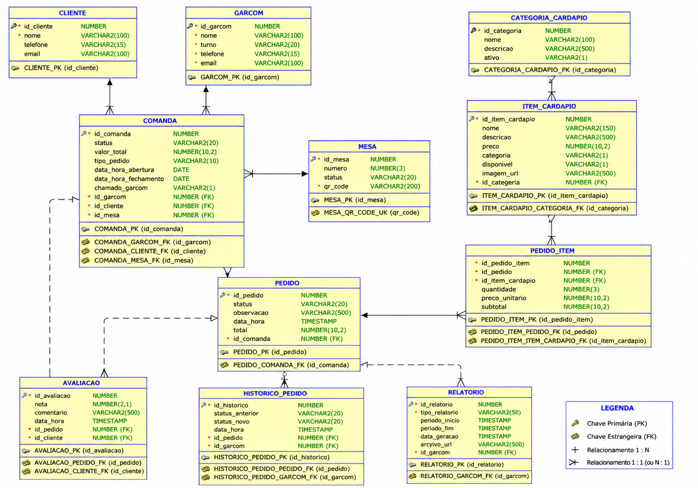


### 🧱 Diagrama de Classes (UML)
Mostra as classes principais da aplicação Java, seus atributos e relacionamentos, além dos *enums* utilizados (`CategoriaItem`, `StatusPedido`).

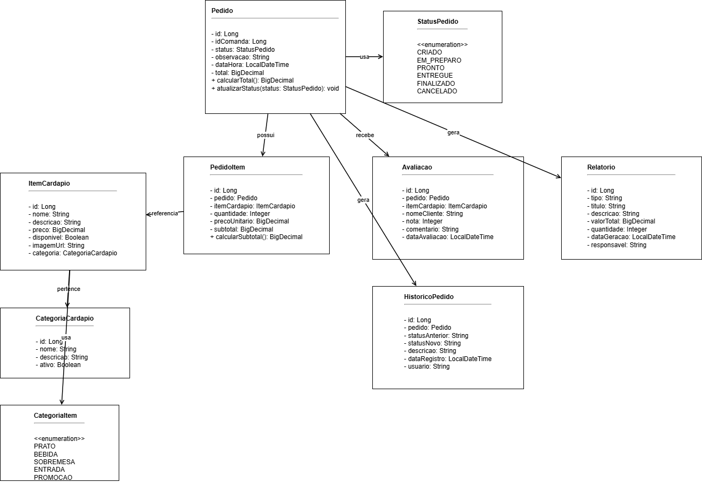

---

## 📸 Evidências de Testes da API

A API foi validada por meio de uma coleção completa de testes no Postman, contemplando operações CRUD, fluxos de negócio e cenários de exceção.

### Cobertura Validada
- 🟢 Operações GET / POST / PUT / DELETE
- 🔗 Respostas com HATEOAS
- ⚠️ Tratamento de exceções HTTP 400 / 404
- 🧾 Fluxos completos de Cardápio, Pedido e Item de Pedido

### Artefatos Disponíveis
- 📬 Coleções Postman: `/testes`
- 🖼️ Evidências Visuais: `/docs/imagens/colecao-postman`

✅ **Todos os endpoints foram testados com sucesso**, com respostas esperadas e tratamento global de exceções ativo.

---

## 🎬 Vídeo de Apresentação

O vídeo de apresentação demonstra o funcionamento completo do ecossistema **Pedix**, contemplando a evolução arquitetural e operacional implementada ao longo da Sprint 4.

A apresentação evidencia a integração entre APIs, deploy cloud em Microsoft Azure, autenticação por perfil, interface web administrativa, documentação técnica da API, integração mobile e validações operacionais da solução.

📺 **Assista aqui:**  
[Vídeo Demonstração Sprint 4 — Pedix Ecosystem](LINK_VIDEO_AQUI)

---

## 🧾 Conteúdos Demonstrados no Vídeo

- ☁️ Deploy da aplicação em Microsoft Azure App Service;
- ⚙️ Pipeline CI/CD utilizando GitHub Actions;
- 🔐 Fluxo de autenticação com perfis Administrador e Garçom;
- 🖥️ Navegação pelas interfaces web administrativas e operacionais;
- 🍽️ Gestão de cardápio e categorias operacionais;
- 📊 Endpoints auxiliares de relatórios e histórico operacional;
- 📖 Acesso à documentação Swagger/OpenAPI;
- 🔗 Navegação REST utilizando HATEOAS;
- ❤️ Validação do endpoint de Health Check;
- 🧱 Persistência relacional utilizando Oracle Database;
- 🛫 Versionamento de banco com Flyway;
- 🍃 Integração complementar com MongoDB;
- 📱 Integração arquitetural com aplicativo mobile React Native;
- 🧩 Organização modular da arquitetura distribuída do ecossistema Pedix.

---

## 🚀 Objetivo da Demonstração

O vídeo foi estruturado para demonstrar:

- funcionamento operacional da solução;
- integração multidisciplinar entre as disciplinas do semestre;
- aplicação prática dos conceitos de backend, cloud e DevOps;
- separação arquitetural entre APIs;
- integração entre web, mobile e banco de dados;
- maturidade técnica e organizacional do projeto.

## 👩‍💻 Integrantes e Responsabilidades

| Nome Completo | RM | Responsabilidade no Projeto | GitHub |
|--------------|----|-----------------------------|--------|
| **Alane Rocha da Silva** | RM561052 | Arquitetura e desenvolvimento da API Java/Spring Boot, modelagem relacional Oracle, interface web administrativa e documentação técnica | [@alanerochaa](https://github.com/alanerochaa) |
| **Anna Beatriz Bonfim** | RM559561 | Desenvolvimento do aplicativo mobile em React Native e integração com camada IoT | [@annabonfim](https://github.com/annabonfim) |
| **Maria Eduarda Araujo Penas** | RM560944 | Desenvolvimento da API principal em C#, integração entre módulos e DevOps | [@DudaAraujo14](https://github.com/DudaAraujo14) |

<p align="center">
  Desenvolvido com 💜 pela equipe <strong>CodeGirls</strong> — FIAP 2026.
</p>